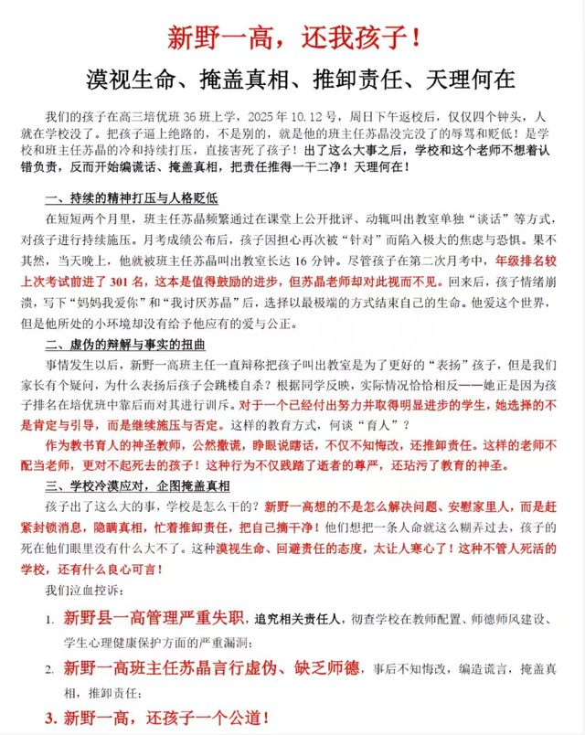

按时间顺序记录一下事实吧，事实用黑色写，谣言或未加验证的内容用灰色写，真假自己推理

发生于十月十二日，即周日返校后第三节晚自习

当天下午月考成绩公布，他从1400多名进步到1100多名，共301名

当天下午和同桌聊天

被班主任叫出去在前门谈话接近20分钟

同桌安慰了他

回到座位后不久突然起身离开，一分钟内跳楼，落在26班或25班前，响声很大

落地没有流一点血

落地头在抬着

是和女友分手后跳楼的

是和女友分手前跳楼的

跳楼后第二天晚上女友到36班门口哭

跳楼前写了半页遗言，有“妈妈我爱你”，“苏晶为什么”，还有让女友再找一个之类的话

当场死亡

死于去医院的路上

死于第二天中午

中间醒过来并说了遗言

学校赔了40万，学校要再赔50万

家长在盛德美举白色横幅，上书“新野一高还我儿子”

家长在抖音发布相关视频，获得一定热度

<0/></>

<0/></>

关于他的大概就是这些吧

关于我们班其他人的，他连个同桌当晚被留在教室，后又去三楼问话，回到寝室后又被喊走问话，十一点才睡觉

第二天被叫去公安局做了一下午笔录，从中午吃饭前到晚饭时

靠右侧窗户和前排的女生被叫走做笔录，班里人最少的时候大概有只一半多

有个女生因为担心下一个会喊自己出去，于是没写作业一直在听，第二天其他人问几句就回去了只有她全盘托出

但是我没被叫走一次

大概就是这样吧，虽然说我写了并不是给谁看，但是总想写点什么

我没有什么好评价的，我不是教育专家，也不懂心理学，也不想唏嘘生命可贵

听说人是不错的，可是我不是很认识，只是他的一个同桌是我朋友

唉，本来想写完这个就去写日记的，写完日记还想查acdemic questions，可是现在已经快十点了，好累

<a href="https://plomshit.blogspot.com/2025/10/blog-post.html">我的同班同学跳楼了</a>