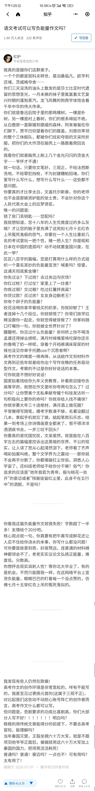
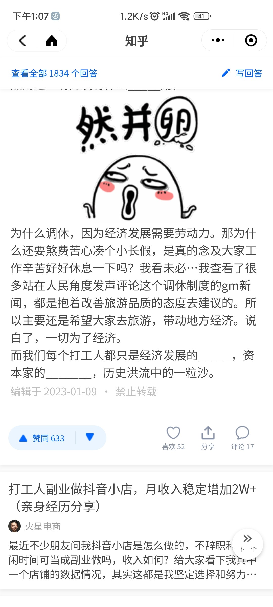

- [ ] 计算机技术、机械工学、化学工业，它们的本体都是工业技术，是为了生产服务的，但它们的定语是通过数学、物理、化学这些基础学科作为方式。所以在我看来历史同样是这样一个基础学科，一个方法论。你知道了黑死病是如何缔造了文艺复兴，你知道人们会因为觉得天体规律丑才有日心说模型，你知道牛顿是怎么想解决曲线的问题才有了微积分的设想，你就能更能明白我们学的一切不是难看的课本文字，而是热烈的智慧碰撞。而这种碰撞可能就让年轻的下一代开启一种可能。
- [ ] 这让我想起知乎上有一个问题：有什么道理，你后悔没有早点知道？    下面有一条获得最高赞的回答： **“如果你家境普通，家里没矿，最好的办法就是努力读书，进入985、211；**

**如果你所读的大学是普通院校，必要时通过考研进入985、211，你会少吃很多苦**

- [ ] 如今的我们看新闻，更多的只是打发时间，作为娱乐手段一种。

再也不像当年，人们站在村头的田埂读报纸，偶尔抬眼看向天空，或舒展或紧皱的眉头间，都是发生在遥远地方的，未曾见闻却又心心念念的事。

- [ ] 跟你说几点吧

1.一切知识本质上都是通过归纳得到的，推理所使用的逻辑学定律本身也是通过归纳得到的。

2.归纳法的核心是实验，只要没有实验结果否定最初归纳的命题，我们就称该命题为真。

3.就学科体系中的公理与定律的定义来看，其中公理和定律都可以被实验所归纳验证，且可以通过逻辑学等学科的知识，用公理推理出定律，但是公理本身无法用推理手段得到，只能用实验归纳得出。

4.对于任何实然性命题（即命题内容不涉及“应该”一词含义的，只描述客观规律的命题），其公理和定律都可以设计出实验对其真假性进行验证（无论实际操作上是否困难）

5.对于任何学科，如果其存在公理与定律系统，则其知识的真实性就取决于：从公理推理出定律的有效性和用实验归纳出公理的可靠性

6.对于任何研究应然性命题的学科（如伦理学），其得到定律的推理形式无效，且不存在能得出公理的实验归纳手段

7.应然性定律推理形式无效：

   其三段论为

   大前提：A（不）应该B

   小前提：若C，则B

   结论：A（不）应该C

   此种推理形式不存在于逻辑学的有效推理     形式当中

8.应然性公理无法设计实验验证：

例如若想设计实验验证“人不应该杀人”这一公理，你可能会说“因为人杀人，社会秩序就会崩溃”，如果用这个思路，等价于把一开始想验证的“人不应该杀人”转化成了验证“社会秩序不应该崩溃”，违背了其公理的身份，且实验实际能够验证的内容也不是“社会秩序不应该崩溃”而是“如果人杀人，则社会就会崩溃”这一实然性命题的对错。

9.故只要试图设计实验验证应然性公理的对错，就不免陷入不得不找另外一个应然性命题来推理的窘境，不然根本无法想象如何用实验验证应然性公理。

10.结论很明显，应然性命题的公理不来自于实验归纳，而是来自于立场诉求；其定律更是建立在所谓公理的无效推理的基础之上。由此可见，应然性命题根本就没有逻辑上的对错性，它只不过是管理者用于控制思想的话术罢了。

@SHERRY

- [ ] 少时喜欢曹操，举孝廉入仕，治世之能臣，乱世之枭雄，扫清寰宇，扶大厦将倾，领兵百万，横槊赋诗，这才叫威武雄壮。

年纪越大则越喜欢少时觉得憨憨的刘备，平原令，转战徐州，转进荆州，荆州呆不住跑西川，屡败屡战，终于在他六十岁上下时，他人生第一次在正面战场上击败了曹操，昭烈皇帝于西川继承大统。

小时候觉得自己绝对是世界的主角，那家伙世界就等我拯救了，长大后才知道，没什么主角，自己更没有什么天赋，而作为一个普通人，可能走不了什么康庄大道了，只能期盼自己能在坎坷中有一颗强心脏吧。因为与恐惧与挫败的战争，将会伴你我终生。

@井天

- [ ] 作者：匿名用户

链接：https://www.zhihu.com/question/22311625/answer/21645163

来源：知乎

著作权归作者所有。商业转载请联系作者获得授权，非商业转载请注明出处。

生活的真相大致如下：

活着的意义是什么？

活着没有任何意义。

人的这一生，没有任何意义。

人本来就是被偶然地抛到这个世界上来的。每个人的诞生，完全是一个偶然。

你之所以是你，完全是一个偶然。

为什么要活着？

——随便，想活就活，想死就死。没有任何一个意义要求你必须活着。也没有任何一个方向给你指引。

存在先于意义，存在没有意义。

说白了，还是那句话：生活没有任何意义，没有任何目的。一切想给生活赋予意义的做法，都是徒劳。

而没有意义，人就会迷惘，就会彷徨，就会自省，就会停下来质问自己：没有意义的事情，我为什么要去做？

如果生活没有意义，我为什么要活着？

那么，为什么要活着？

——因为清晨的第一缕阳光很美。

戴上耳机，循环River flows in you很美。

巴赫的Partita for Violin No. 2很美。

在深夜独自读一本温暖的小说很美。

在夕阳下，拉一张椅子，静静发呆很美。

跟心爱的人依偎在一起看电影很美。

苏州的小桥流水，拙政园的山石很美。

哑巴生煎的包子、夜晚的观前街小吃，很美。

跟朋友喝啤酒喝到醉倒，很美。

夜晚的海浪声，渺远而空茫，很美。

……

停住。

这样的句子，我可以无穷无尽地写下去。但是，这也没有意义。

类似的话，已经说得太多，无非“热爱生活”而已。

但是，生活既然无意义，为何还要热爱？

我觉得，只是因为，人类的身体，会有局限性，会死，旋生旋灭。

但人类的心灵和思想，可以跨越永恒。

人是伟大的，因为人能够知道，自己的存在没有任何意义。

鸟知不知道这一点？树知不知道这一点？

但更伟大的，是知道这一点之后，仍然相信生命。

每个人都在路上。

有些人渴望到达目的地。当他知道没有目的地之后，他就停下了。

有些人执着于欣赏沿途的风景，但他从不问自己为什么在路上，为什么要欣赏风景。

有些人从来不关心这些，他就是自顾自走着。

有些人在原地打转，思考自己为什么要上路。

佛家说：万法皆空。入我门来，但求不入轮回。意义是求解脱。

基督教说：天父慈爱，众生如子。意义是入天国。

道家说：清净无为，但醉且眠。意义是不染世俗。

**所谓真正的英雄，就是终于能够放下对意义的探求的人。**

- [ ] 

<0/></>

- [ ] 

<0/></>

- [ ] 第三旋臂边缘

一颗蓝色行星上

碳基生物正在庆祝

他们所在的行星

又在该恒星系里

完成一次公转

他们也知道

整个太阳系

也是围绕着银河系公转

错过的位置

永远也不会再回来了

而银河系也在飞驰

甚至空间本身也在膨胀

他们走过的路

穷尽时光，无法回头

而他们的高歌跨过时空

而万物的细语超越时间

他们曾拥有 闪亮的日子

他们的梦与渴望将化为光

在每一个凶险的转角处

波与粒也在喃喃自语:

一切存在的意义

在于存在本身

新年快乐