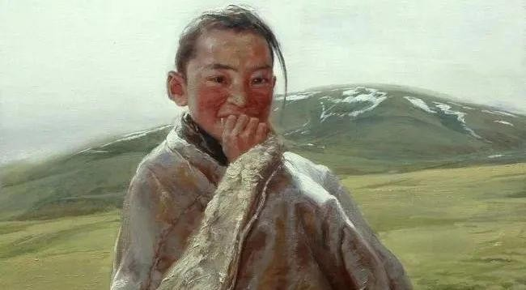

<0/></>

仇恨就像膨胀袋子，你在意它，它就会越来越大；你忽视它，它便慢慢消失。 你之所以总是闷闷不乐，因为人际关系之间的小摩擦，搞得心力交瘁，你越是耿耿于怀，心里放不下，就越是不痛快、烦恼丛生。 你坐公交车挤地铁时，脚被人莫名其妙踩了一下；你在公

仇恨就像膨胀袋子，你在意它，它就会越来越大；你忽视它，它便慢慢消失。

你之所以总是闷闷不乐，因为人际关系之间的小摩擦，搞得心力交瘁，你越是耿耿于怀，心里放不下，就越是不痛快、烦恼丛生。

你坐公交车挤地铁时，脚被人莫名其妙踩了一下；你在公司里，同事为了成功上位，对你背地里给上司打小报告；你因为没结婚，年纪有些大，被亲戚在背后各种蛐蛐；你因为没钱，事业处于低谷，被伴侣冷落贬低。

生活中遇到这些事情，你第一反应就是狠狠怼回去或者怒骂，毕竟都是人，谁都能维护好自身的利益与自尊。

古希腊神话中有一个故事：战神海格力斯有一天在回家路上，看到一个鼓起来像皮袋的东西，他踩了那东西一脚，那东西却越胀越大，他直接用木棍敲打那玩意儿，结果却膨胀大到堵住了海格力斯的去路。

结果出现一位智者告诉他：“这东西是仇恨，你越是报复它，它越是强大，当你忽视它，忘掉它，就会慢慢消失了。”

这个神话在心理学上被称为“海格力斯效应”，是人类最原始的本能自我保护和攻击性，一旦自身的利益、尊严和情感受到威胁，就会下意识启动保护措施。

当你任由情绪发泄，低级地去报复对方，消耗大量精力和时间去自证清白，反而会滋养了“仇恨皮袋”，你也会沦为海格力斯。

这样的结局往往就是：愤怒以愚蠢开始，却以后悔告终。

成不了心态的主人，必定会沦为情绪的奴隶。

守好课题，别进他人的情绪泥沼

俗话说：将军赶路，不追野兔，欲成大树，不与草争。

你只需抬头赶自己的路，不要去追赶迷路的野兔，想要成为大树那样的人，就不要陷于底层跟小草争争吵吵，消耗在底层的烂人烂事之中。

你在马路上碰到了无赖撞到你，可能他正处于失业状态；公司里处处刁难你的领导，可能他随时面临被辞退的窘境；那些嘲笑挖苦你的朋友，也许他欠了一屁股债正在吃泡面度日。

毕竟人性中最大的恶，就是在自己最小权利范围内，最大限度地为难别人。

当自己过得不如意时，只能通过贬低同类加以缓解焦虑，短暂地忘掉自己困境之中的苦楚。

欺负阿Q的人有很多，但阿Q却敢动手欺负比他弱小的女子，比如吴妈和小尼姑。

软弱之人通常都是欺软怕硬，对强者唯唯诺诺，对弱者横加指责、故意为难。

他们过得不好，生活一团乱麻，唯有将恶意泼出去，甚至故作强势地摆出一副很厉害的模样，他们之所以想激怒你，无非是想拉你一起入水，以此慰藉心里的不平衡。

如果这个时候你愤怒了，与之纠缠，只能说明你中了他们的奸计。

当别人攻击你、羞辱你的时候，不要跟往常一样立刻去对抗，报复别人，而是让自己平静下来，不做回应，允许小我处于受攻击、受压制的状态，也许一开始会感到不舒服，但持续一段时间之后，你会发现内心有种开拓的新生感。

高人人捧人，小人人踩人。比你层次高的人鼓励你，跟你同层次的人欣赏你，层次比你低的人诋毁你。

遇到烂人，守好自己的课题，及时抽身，不入他人的情绪泥沼，不理会，不纠缠，自洽自渡。

不对外在的攻击产生习性反应

就是当虚荣的小我被减弱，真正的意识本体就会被增强。

不理会、不纠缠，其实不是你被缩减，反倒是你被拓展了，也就是老子《道德经》里所讲的秘诀：示弱处下，做山谷而不做高峰。

同样在《圣经》中也有此类观点，别人请你吃饭，你不要立马坐上位，你坐在下位，主人会将你请到上位，凡是自认为高贵的人，必将为卑劣，而凡是不在乎卑劣的人，必将升为高贵。

示弱是一种人生顶级智慧，看似退步，实际进步，以退为进，以柔克刚。

本身身弱之人，倘若你还去争强斗狠，那样会更快消耗掉自己的能量，让自己变得更加虚弱。

身弱之人得明白“地低成海，人低成王”的道理，低并不是低下，弱也不是软弱，而是另一种维度的处事法则。

对象埋怨你赚钱少不细心，别去争吵，继续做自己开心的事转移注意力。

公司同事蛐蛐你能力不行，删掉帮他做的文案策划方案，埋头做好自己分内的事就行。

成年人的世界里，争吵和打闹无意义，既浪费时间，还间接拉低了自己的身份和档次。

当黑粉在直播间刁难大冰时，他一律笑着回答：“您说得都对。”最后黑粉自知理亏，踉跄而逃。

兵强则灭，木强则折，强大处下，柔弱处上。

当你拥有了稳定的自我价值

就可以拥有被讨厌的勇气。

那些最会经营人生的行者，都懂得幸福退让原则，因为这才是世界上最划算的买卖。

心理学上有一个“镜子反射效应”，就是他人对你的态度，其实就是你内在的镜像投射，当你价值处于低位时，不要哭哭啼啼地去强行干预某些事，你只需经营好你自己就行。

与其总是向外求，在意别人的看法，倒不如把自己活成一个太阳，自己为自己发光。

面对仇人和那些攻击你的人，你得明白不战而屈人之兵，方为上上策。

别人朝我扔泥巴，我拿泥巴种荷花，当你把别人的屁话当做耳旁风，原来它还可以用来避暑。

大象从不在意蚂蚁的挑衅，真正有能力的人，他们只专注于提升自我价值，不因别人的否定而轻视自己。

保护好自身的能量，不断地学习和成长，将恶意当做一场暴雨，而暴雨过后不过是漫天彩虹，余生很贵，切莫因小人而浪费，更不要自我内耗而错过满天星辰。