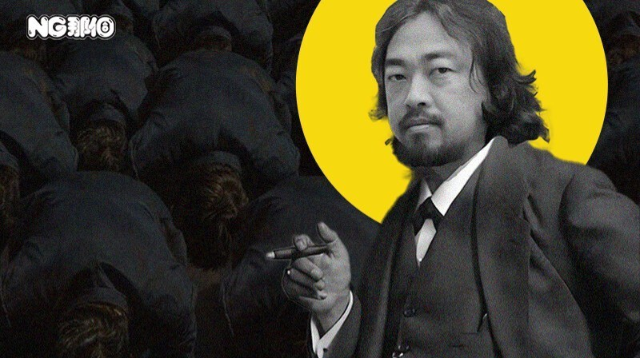<0/></>

出品 | 虎嗅青年文化组

作者 | 黄瓜汽水

编辑、题图 | 渣渣郡

本文首发于虎嗅年轻内容公众号“那個NG”（ID：huxiu4youth）。在这里，我们呈现当下年轻人的面貌、故事和态度。

互联网用户的历史观主要有两种。一种历史是由人民群众创造的，另一种历史是由伟大人物推动的。

别的事不好说，但仅就性别议题来说，互联网性别战争的走向，离不开一位伟大的民间哲学家。

那就是弗洛伊德·峰哥。

他是性别战争中的阮小七，有且只有峰哥，才能在大压抑时代如鱼得水。

只要B站还存在一天，陈睿就不能不拜谢这位真正的百大帝王，散落民间的性压抑教父，研究两性关系的院士。

<0/></>

B站Up主@峰哥亡命天涯，纪录片导演，极限旅行家，国家一级登山运动员，自驾游专家，自由潜运动员，滑翔伞飞行员，水下摄影师，B站知名孩子王。

但这些title全都不重要。

在广大人民群众眼里，他最重要的身份，是“中国两性关系教父”，遗落民间的“连接仙人”，B站的“下三路之王”。

<0/></>

柏拉图和亚里士多德一定想不到，真正的雅典大学堂其实在中国B站。

聊起男女连接，b友们就忘情了发狠了，不知天地为何物了。

这一切都离不开广大b友们的精神导师周丽峰。

他的直播间，就是中国青年男女裤裆故事万花筒。

连接，即男女肉体发生关系，是一种非常信达雅的隐晦注释。只要把这两个字念出来，成年人都懂是什么意思。

峰哥对世间万物的评价，可以用四个大字概括——想连接了。

只要聊起男女连接那点事，峰哥就犹如文曲星下凡，背后突然出现一束耶稣圣光，循循善诱每一个迷茫的灵魂。平时他左眼站岗右眼放哨，只要一聊起男女连接，他的眼神犹如社科院院士般博学笃定。

打开峰哥的直播间，就像翻开十年前街头巷尾到处散播的男科医院小手册，琳琅满目，写满了有关男性下三路的苦楚和酸涩，算得上是一本赛博《b友口述性生活合集》。

<0/></>

“峰哥，连接时女友没反应怎么办？”

一位理工科肥宅，家里介绍了女朋友，女朋友在家长面前知书达理善良勤快，一到两个人独处的时候就变得特别冷淡，牵手像僵尸，连接像死鱼，不主动也不反抗。

峰哥听完患者主诉，抛出一则关于“东食西宿”的寓言。

两个男人在洗澡堂里谈论自己的女朋友，一个男的说，我女朋友对我没有要求，只需要我往家里拿钱就行，平时没有夫妻生活。另一个男的说，我女朋友也对我没有要求，只需要跟我每天疯狂连接，还给我拿钱。

两个人听完都非常羡慕彼此，最后俩人一对帐，发现女友是同一个人。

连线老哥的沉默回荡在今晚的康桥。峰哥继续追问：那我问你，你的打击力、节奏和攻速怎么样？有这个自信吗？

都是男的谁也别装了。有些人明明是个双截棍，非要佯装自己是方天画戟。

弹幕已经笑成一团，大家在一片欢乐快活的气氛中送走了沉默的肥宅老哥。

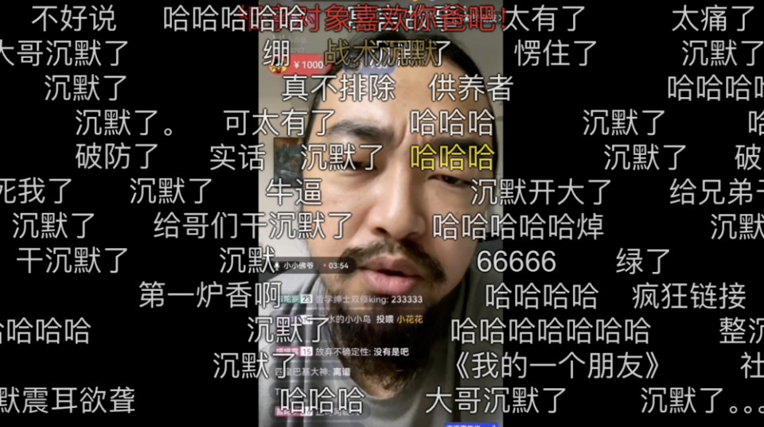<0/></>

还有一则故事，可以称其为《b友连接初体验之倦鸟难归巢》。

一位b友和女友尝试连接，但是俩人都没经验，不得其法，忙得焦头烂额也无法成功进洞。

b友询问峰哥，是否因为自己这些年品鉴了太多特殊影像，阈值被拉得太高，枕边人已经无法对自己产生足量的性刺激。

说完之后，b友又一次补充自己对女友身材的不满：长相不错，可惜体脂太高，穿搭也不符合自己唯爱黑丝高跟的审美。

峰哥听完患者主诉，立刻指出病灶：我估计你本人也挺胖吧。

只见峰哥仙人指路，寥寥数语，一副当代年轻人蹩脚性生活的画卷徐徐展开：

“两个胖子肚皮贴肚皮，肚子加在一起都有10厘米了，下面再干着急，一脑袋汗，也是倦鸟难归巢，船舶难回港，苦不堪言。”

除了《万物连接法则》，峰哥还深谙黑格尔唯心主义辩证法。

任何坏事到了峰哥嘴里都会变成“这是个好事儿啊”；而好事到了峰哥这里，就会等来一句转折“恰恰相反，这并不是个好事儿”。在峰哥嘴里，白事都能说成喜事。

依我看，国内这些高校的马院就应该特聘峰哥给大学生讲解什么叫真正的辩证精神。

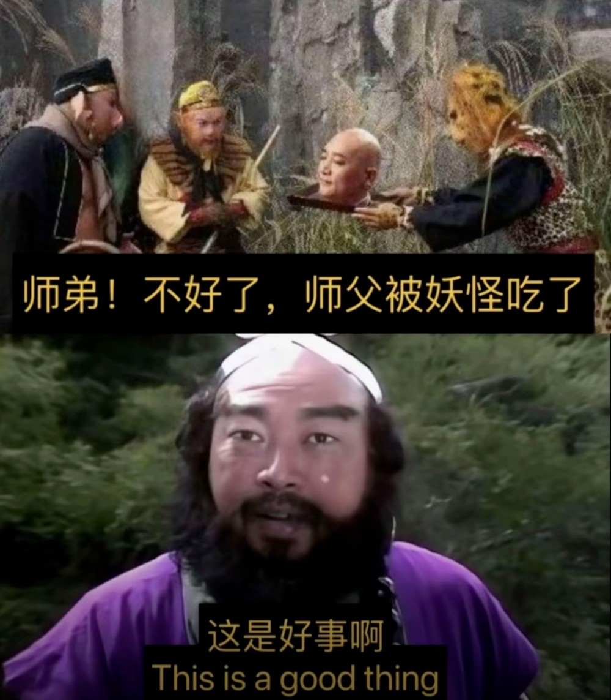<0/></>

有一位33岁的b友投稿：

我长相学历家庭条件都相当不错，一直怀疑女友出轨，蓄谋已久回家抓了个正着。女友哭了4个小时，那个男的还把我打了一顿。我拿着照片去找女友她妈，本来对方要40万彩礼和学区房，出事之后她妈说啥都不要了，还要给我买房，倒贴20万嫁妆。峰哥我现在很矛盾，我该怎么做？

想必熟悉峰哥的b友已经学会抢答了：这是个好事儿啊。

峰哥迅速捕捉到了故事漏洞。强调自身条件完美，或许恰恰掩盖了自身的致命缺陷，比如器官质量不过关。不解决自身缺陷，绿帽之帽无穷尽也。

峰哥苦口婆心，伤口泼油：“你找下一个，未必这种事情不会再次发生，到时候你再抽两包烟吗？”

辩证精神魅力时刻到来。“既然对方给你带了绿帽，你跟对方结婚之后，她有把柄在你手里，你的日子会过得顺心一些，还挣了20万嫁妆和一套房。”

只要放宽心，一顶绿帽子压不死人。

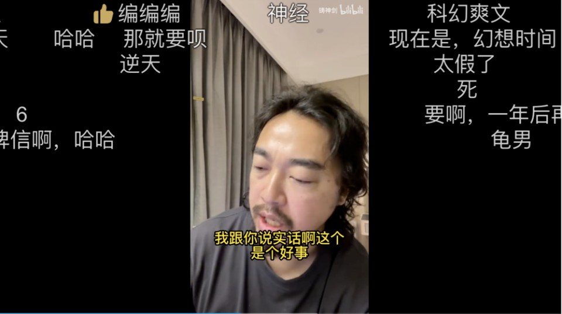<0/></>

如果不点进峰哥的直播间，你可能想象不到中国有多少30岁以上的青年从未体验过男欢女爱，从未感受过肌肤之亲。

他们对爱情与性事，保持着又渴望又畏惧的心理。一边远远观望，心有戚戚；一边又抓心挠肝，夜不能寐。

峰哥的出现，弥补了中国教育系统中缺失的那部分性教育。哪怕连线的另一头是人到中年的死宅男女，他也能不厌其烦，从如何搭讪接吻拥抱教起。

如果说这不算雅典大学堂，那到底什么才算真正的性教育？

根据峰哥的两性关系方法论，所谓搭讪，其实就是有事说事，想象一下幼儿园小朋友如何交换玩具就可以了。

性压抑男青年之所以害怕搭讪，是因为他们在张嘴之前心里面已经有反应了。下面火急火燎的，藏了一根定海神针，内心自然就阴暗了。

正所谓无欲则刚。心里黄，说出来的话也歪了。

不仅如此，峰哥的出现，还及时纠正了互联网弥漫已久的厌女风气。

某些男性在互联网性别对立战场缠绵太久，成日忧心恐惧自己变成接盘的沸羊羊，感到未来婚恋生活无望，遂来到峰哥直播间求助。

这些男性坚信一条准则：钱是给女孩看的，不是给女孩花的。这是所谓的alpha男性精神偶像为他们灌输的信条，即成功男人绝不给女人花一分钱，只需要晃晃钱袋子，就能吸引大批女性上钩连接。

结果他们被峰哥逮住狠狠羞辱一番：

“一个人要傻x到什么程度，才会跟童锦程共情啊？有童锦程的长相，不仅不需要给女人花钱，只要愿意下海，有的是女人给他花钱。”

那么问题来了，面相不佳的b友们该怎么办？

峰哥一句话锐评b友：说白了还是没有性魅力。既然没有性魅力，花钱购买异性注意力，就别喊冤。

“丑人是有原罪的，钱就是你的赎罪券，你要是没有这个赎罪券你更啥也不是了。”

在峰哥看来，这个世界就是一个巨大的免费网络游戏，95%的人都是臭屌丝，让你们进来玩，难道是为了占着带宽和服务器的吗，“不就是进去让你挨高富帅的砍吗。”

免费玩家就别共情高端玩家了，人家说的话都是哄你玩的。

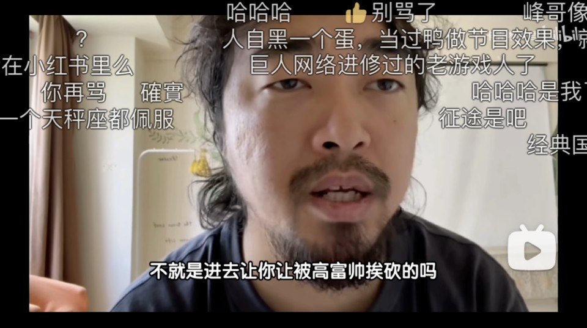<0/></>

为什么性魅力在两性关系中至关重要？

因为对于东亚做题家们而言，工作学习财富都可以努力获得，但性魅力没有就是没有，努力不了，不会骗人。

道理很简单。女性看到有钱的男性，或许还会为了物质委身；一旦她们看到有性吸引力的男性，无论如何都会产生生理反应。

那么问题来了：b友们该如何判断自己是否具备性魅力呢？

峰哥设计了一套《性魅力鉴别操作手册》：想知道自己几斤几两，照照镜子呗。

首先，把自己脱光了站在镜子前面，旁边放着你女神的照片，自己审视一下双方，像不像日本av里面的猥琐男和漂亮女孩？

接下来，把你和女神的合影放到虎扑或者孙吧上面，聆听一下来自同性群体温暖中肯的批评。

如果你确实是个性魅力缺失的大龄单身青年，那么你将会迈入人生最大的难关：

性压抑。

<0/></>

精神分析学派掌门人弗洛伊德遗落在远东大陆的真正衣钵其实是峰哥。

作为中华大地首位研究性压抑现象的民间赤脚医生，广大性压抑b友的精神教父，《绝对性压抑批判》开创者，峰哥的成就脚踢弗洛伊德，拳打拉康。

弗洛伊德说：“人类的一切痛苦，都是因为性欲得不到满足”。弗洛伊德的嫡传弟子峰哥跟随先贤的脚步，进一步提出伟大的论述：“一切精神问题都源于性压抑”。

一位海外ip的网友在评论区说，自己把峰哥直播间的理论复述给外国心理学教授，教授大喜，邀请他一起开启学术研究。

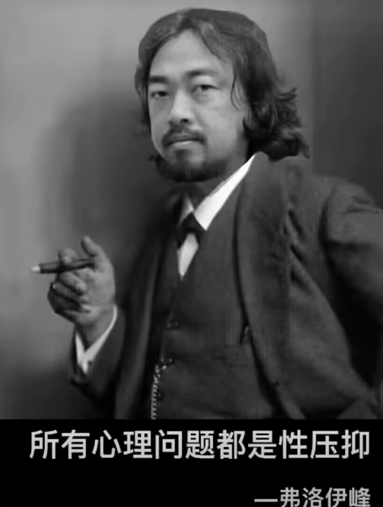<0/></>

峰哥曾精准指出，当今互联网汇集了一群三低（3d）人士：低学历，低智商，低素质。

他们年少热衷抬杠，中年性压抑，老年骂骂咧咧。怨天怨地怨社会怨女人，就是学不会审视自己。

而峰哥的主线任务就是治病救人，点拨性压抑的3d人士，让他们走出阴霾，拥抱光明。

如果你有幸在峰哥的直播间里观摩几分钟，就会感受到一股浓郁的来自中国男性青年的压抑の味，可谓群贤毕至，少长咸集。

b友们倾诉起来自己的性压抑往事，仙之人兮列如麻，足够整编一本《百年压抑》。

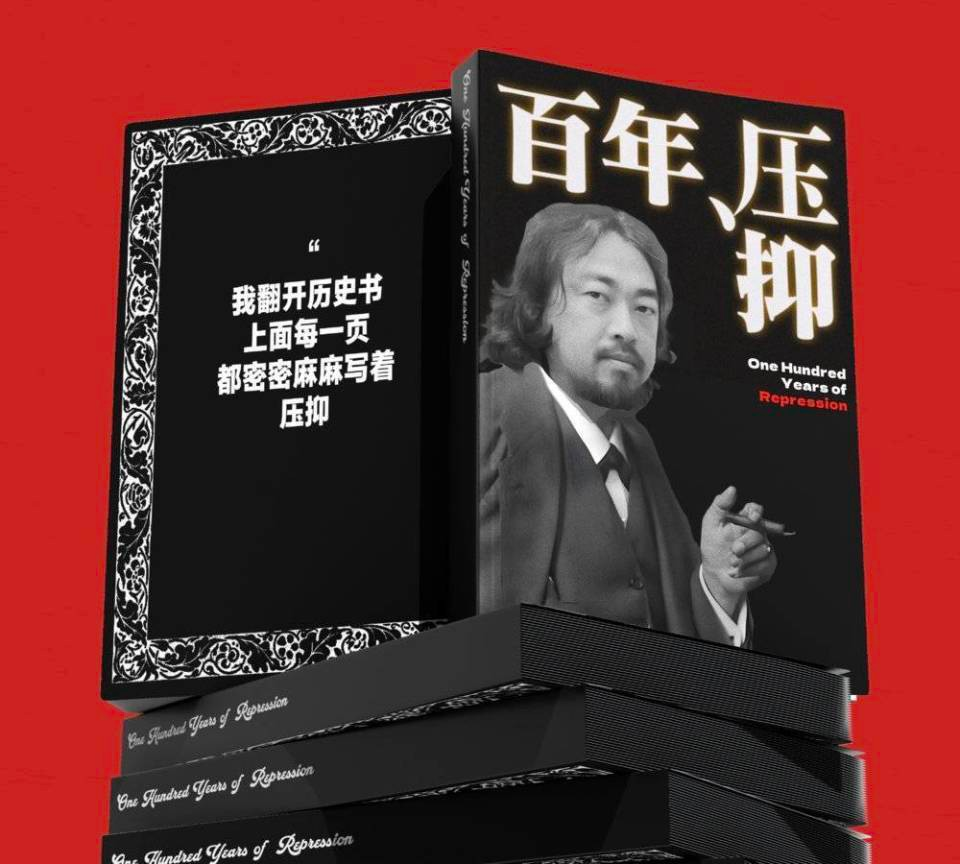<0/></>

以一位典型“3d”的b友提问为例：和学姐看电影，她主动把手放在我的座位扶手上。吃饭也坐在一起，一周前我主动拉了她的手，她说她不想谈恋爱，我百思不得其解，难道是我自作多情了？

峰哥听完莞尔一笑，抛出连环质问。

电影院座位扶手不就中间那一个扶手吗？

她不放那个扶手上她放哪啊？你的左扶手不就是她的右扶手吗。

那不然她放哪？两手放裤裆里夹着啊，还是放屁股底下坐着啊？

在性压抑b友面前，女性的举手投足都会变成释放性信号的动作。胳膊抬起一寸，就会被认为是深夜连接邀请；裙子短了一截，那更是心术不正，故意勾引男人。

甚至还有逆天b友提问：女孩吃饭喝了冰饮料，是不是暗示可以连接？

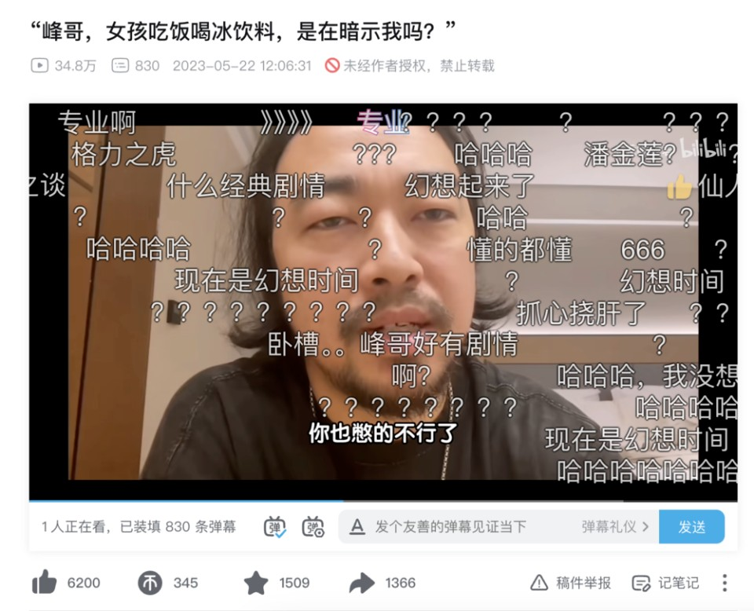<0/></>

如此压抑的提问一抓一大把，投稿者和匿名的弹幕区构成了这个世界上最压抑的暗黑失乐园。

比如“看到国内女孩喜欢外国男人，就忍不住生气”。

峰哥作出假设：“如果我和一个俄罗斯女人睡觉，俄罗斯男人会生气吗？不会，因为他们认为自己是一个强势民族。反而是中国人去东南亚和当地女人睡觉，还会沾沾自喜，自夸是去东南亚扶贫的。”

什么人会生气？是那些“把女性当成自己的资源，女性被别人抢了一个自己就少了一个”的人。

正因为他们没对象，所以在精神上认为全中国女人都是自己的准对象，是自己名下的性资源。

任何一个和自己无关的女性与外国人交往，对于他们而言都是一顶硕大的绿帽。虚拟的绿帽一戴上，便苦不堪言，哭天喊地。

峰哥再次引用趣味小寓言教导b友：狗往电线杆子上撒尿，过两天一闻没味儿了，嘎嘣一下就得抑郁症了。

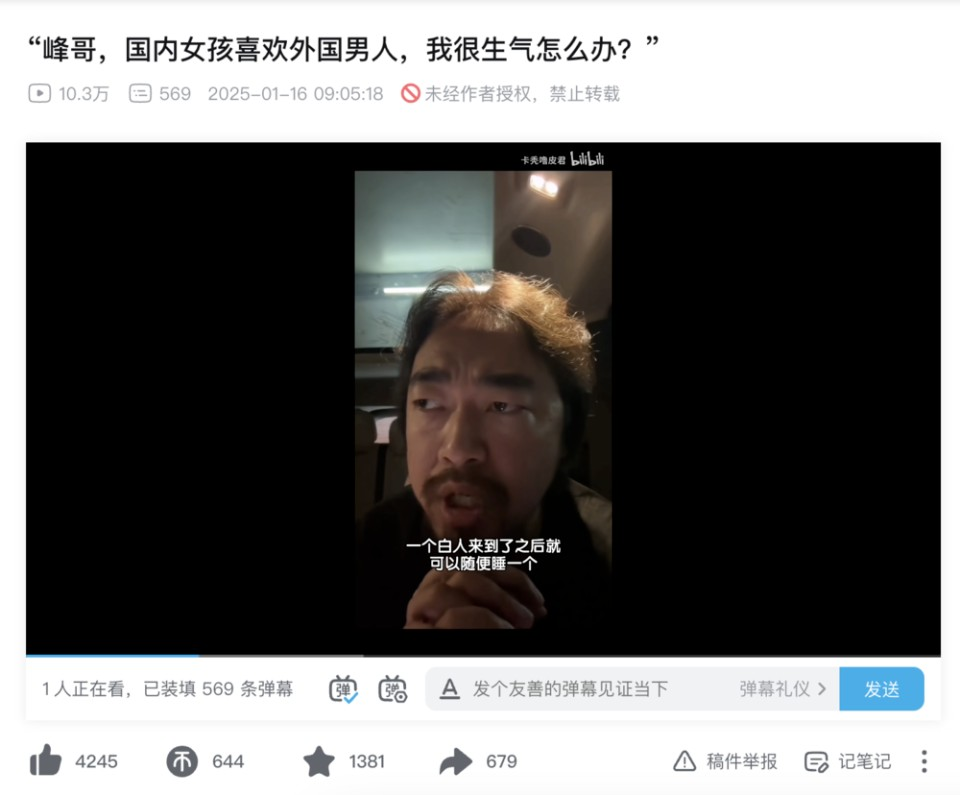<0/></>

再比如“女友从前跟人同居过，感觉女友不干净了”“追了两年的女神，在别人眼里只是炮友，感觉尊严被践踏了”。

弹幕完全陷入污言秽语的狂欢。什么女神变泡芙了，公车私用了，形状变了。

峰哥反问投稿人，你的女神/女朋友/暗恋对象从始至终都是那个人。你喜欢的就是这个人，就因为她有过性生活，你就觉得她变了，于是反手给她扣上荡妇的罪名。

其实她变了吗？没变。变的是你自己，是你因为对方有了性生活就急得跳脚。是你自己幻想一个女孩好几年没有性生活，守身如玉地等着你。

一个女性，为什么会成为你的女神？

是因为她身上幽默善良的闪光点，还是因为她仅仅是一个你想象中的，没有性欲的处女？

b友们之所以性自卑，是因为潜意识中默认所有男人都比自己强，自己的表现无法满足异性，自己的性能力毫无竞争力，只有被食物链淘汰的份儿。

所以处女情结应运而生。只有一个什么都没经历过的女性，才无法将他们放置在比较的坐标轴之上，才是最让他们有安全感的配偶。

b友挂在嘴上的几套词“磨损了”“松了”“脏了”“形状变了”，其实就是自身性自卑的一种外化。

峰哥在屏幕外连环叩问b友，振聋发聩，字字珠玑，用心良苦：

同样是螺母和螺丝，难道你那玩意儿不磨损吗？

b友总说别人脏了，那对于别人来讲，你那玩意儿就干净吗？

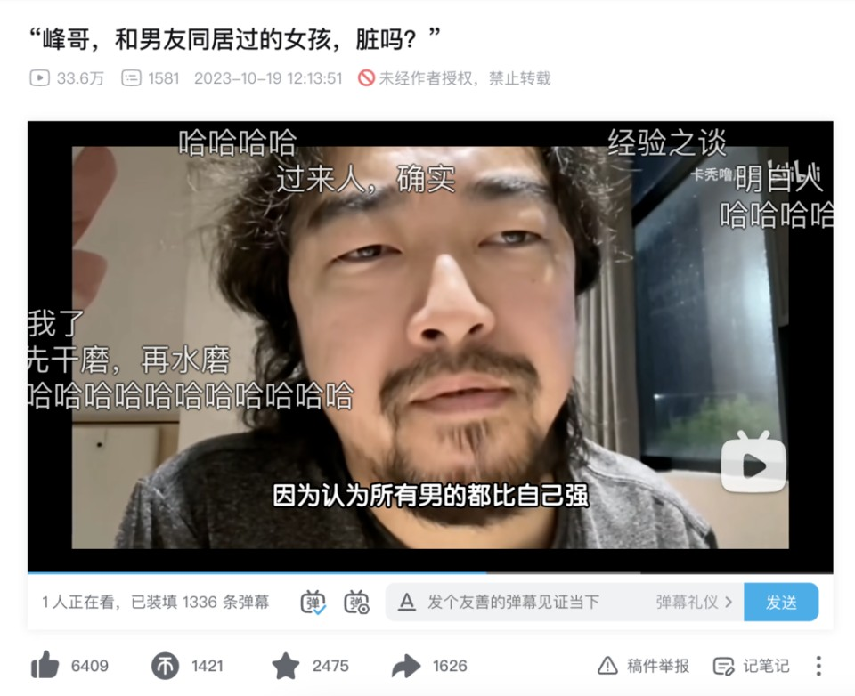<0/></>

<0/></>

<0/></>

3d人士总是苦大仇深平等地厌恶着每一个不符合自己处女情结的女性。

女性不要跳舞，太骚；不要穿短裤，太浪；不要买奢侈品，太贱。

最重要的是，女性不要有任何性魅力——因为我自己没有性魅力。

他们梦想中的完美老婆，必须符合如下标准：素颜不化妆，用安卓手机，不背名牌包，做饭好吃。具像化代表就是王冰冰和章泽天（嫁给刘强东前），还必须是勤俭贤惠的版本。

所谓的好老婆法则，其实是3d人士自己社会地位的体现。

用安卓手机，是因为自己觉得苹果代表奢靡的生活方式；素面朝天，是因为化妆品太贵，我老婆不能花这个钱；背帆布包，是因为香奈儿都是智商税，我买不起；做饭好吃，是因为不用花钱下馆子，又省钱了。

人的一切痛苦压抑，其实都源自对自己无能的愤怒。

峰哥的战略定位，实际上是从大白话与实战经验的角度切入，为b友开创性教育与两性尊重的九年义务大讲堂。

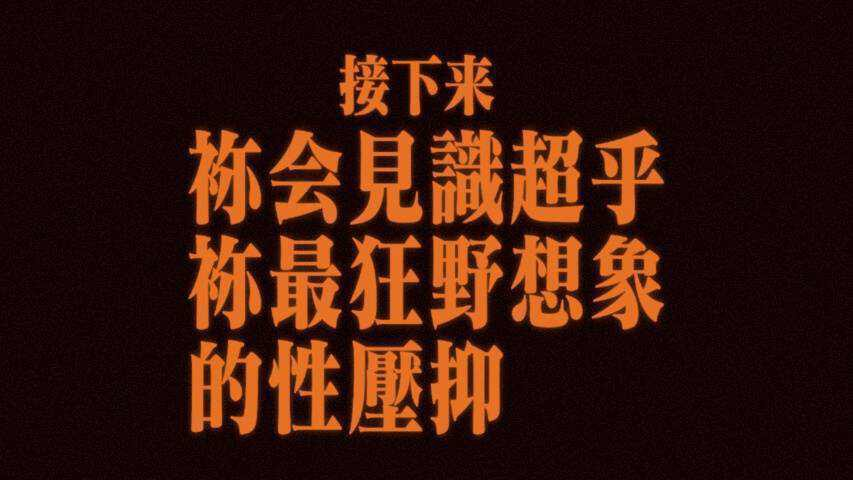<0/></>

那么问题来了，b友们为何如此性压抑？

一是资源分配。

女性受教育程度提高，女性向上选择，不向下开门。人人都向往金字塔顶端，集中在底部的人群便无人问津。

压在下面的人一憋屈，就开始怀念过去的美好时光，“以前的女人多淳朴啊”“以前的爱情多美好啊”。

没说出来的那句话其实是：还是以前的女人好骗啊。

二是“渴厌二象性”。

鲁迅在当今中国语境下依然有效。

他们看到球场上玩腰旗橄榄球的女孩就想抓人家的屁股，他们在网络上忿忿不平，看到玩飞盘和穿瑜伽裤的女孩，就忍不住输出1个G的黄色笑话。日常给女孩们造黄谣，躺在宿舍半年没洗的床单上乐得口水四溅。

只是因为他们抓不到那个屁股。

喜欢哪个女性，就盯着那个女性的屁股看，既然无法连接，就想办法骂一骂，过过嘴瘾也是好的。

他们为什么从来不骂技师？因为只有技师，能在花钱的前提下陪他们连接一次。

李安在《喜宴》里的那句话永远不过时：你正在见证一个民族五千年性压抑的结果。

人必须要有性生活，没有性生活就会陷入一种巨大的群体性癔症。长期受压抑的力比多无处释放，总会以另一种方式倾泻而出。人活一世，被交配二字奴役半生。

哪怕通透如老峰，获得了阳痿的至尊福报，也依然在深夜的直播间对着袒胸露乳的小姐姐眼睛发直——

谁又不是性压抑的其中一员呢。

<0/></>

教导处男如何连接，为性压抑的b友指明人生方向，都是峰哥肉身成圣之路的其中一步。

广大网友对峰哥的评价总结为一句话：老峰中肯。

峰哥之所以从当初那个痛饮恒河水、卧底三和市场的狠活达人，变成如今B站的精神大股东，还在于他的对社会时事看似抽象实则精确的剖析。

正所谓兽面人心，话糙理不糙。一个看上去像homeless的丐帮帮主，却能点破许多精英都避而不谈的社会矛盾。

不管是几年前骑单车为爱冲锋的男大学生，还是去年的重庆胖猫事件和今年吵翻天的山西大同订婚强奸案，在峰哥看来，都是这片土地上的性压抑男性群体大团建。

只要涉及到裤裆里那点事，他们就永远以自己的裤裆为主。这才是真正的立场优先。

再重要的事能有我裤裆重要吗？他们恨不得躺在地上哭闹吐口水，也要让国家发一个对象给自己。

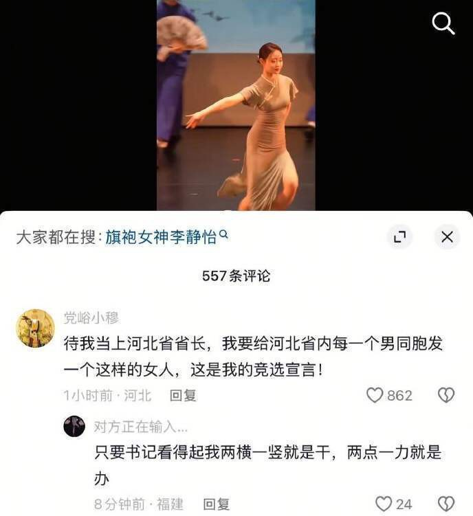<0/></>

每当社会新闻发生，总有人把逻辑思辨能力抛到九霄云外，一股脑扎进所谓的性别战争中。

“我们男性要团结起来，不和女的结婚了，给她们点颜色瞧瞧”，这就是最朴实无华的3d男性思维。

所谓的性别战争，其实是最无聊的口水仗，打了半天，连自己的阵营到底在哪边都没分清楚。

“男的有一个误区，以为男的和男的是一伙的，女的和女的是一伙的。事实上，是我们高富帅和白富美一伙，你们臭屌丝和小仙女一伙。臭屌丝和小仙女，臭鱼配烂虾，还互相看不上，在网上骂骂骂。等到了三十岁被父母催婚进入相亲市场，相逢一笑泯恩仇，相亲三天就结婚，夫妻生活基本以关灯为主。”

峰哥指出，中国男人在交配权上处于弱势，所以他们才会如此恼怒压抑。

如果你真的不在意交配，风轻云淡，那你就不会产生任何负面情绪。说到底，依然是繁衍焦虑在作祟。越焦虑，越不知道靶子在哪里，只能对着空气猛挥拳。

“男性在求偶上是被动的。如果男性长期的不疏通不排解，他就有暴力因子，身体分泌一种物质让他变得特别好斗，但是现代文明社会不能打架斗殴，这也是为什么现代社会需要竞技体育，竞技体育抑制男性的斗争基因。同样是结不了婚，女的抱怨几句就过了。男的不行，生殖焦虑，性压抑，谁越在意这个，谁就越压抑。”

峰哥从来不以性别划分立场，导致许多b友听完峰哥一席话纷纷破防，恨不得立刻开除峰哥男籍，痛骂资本峰媚女。

“你们天天说女的不行，到底是哪个女的不行？是网上的女的不行，还是身边的女的不行？你到底恨的是谁？到底哪个女的坑你害你了？天天国女国女，你妈不是国女吗？”

有个b友吐槽，峰哥对于纹身的女孩包容，对于同居的女孩包容，对于在夜店工作的女孩包容。

峰哥反将一军：那我也没有骂过纹身、同居、夜店上班的男孩啊。有一个同居的女人，那必然就有一个同居的男人。

巨石强森也纹身，b友们为啥不敢骂？当然是因为女的好欺负呗。

一位通过雅典大学堂实现身心净化的性压抑b友现身说法，分享自己学习《峰选》后摆脱3d思维后的感悟：

性压抑人士在生活中根本接触不到异性，于是他就把所有异性想象成不洁的下等人。

他们本身就缺乏性魅力，因此在不违法乱纪的情况下，想要人体连接一次，只能苦苦盼着相亲。

现实生活中接触不到女性，网络上的天价彩礼和接盘事件就变成性压抑人士的发泄点。

那些关于“纯情男和捞女”的缝合故事会，就是精准定位社会对立情绪的狗粮，谁吃得香谁知道。

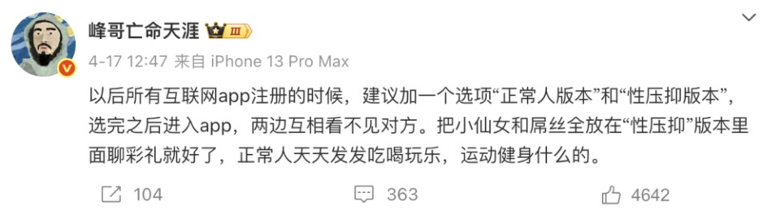<0/></>

人们天天为了彩礼吵来打去，更是毫无意义。

作为一个人类，你完全可以不参与这场游戏，不进入繁衍的流程。只要你认同彩礼和婚姻买卖并且参与传宗接代，那就不要抱怨。

甚至这场游戏没有竞争对手参加，就根本玩不下去。

“男性和男性之间本来就是竞争关系，谁跟你团结啊。为啥要给彩礼？因为其他男人给。本来就没人和你团结，大家都在抢。你跟你哥团结，娶一个媳妇，你愿意吗？亲兄弟都做不到。”

螳螂交配之后，母螳螂营养不足，公螳螂自愿被吃掉。三文鱼冒着生命危险洄游淡水区，只为了繁衍的那一哆嗦。

有时候，人类就是克服不掉身上的动物性，才产生了这么多争辩不清的矛盾。

“人生可以不只为了那一哆嗦，你要是为了那一哆嗦，你就别抱怨了。传宗接代的传统文化，既然你要维护这个，不做出点牺牲怎么维护啊？那你就使劲攒钱娶个媳妇给你家传宗接代呗。”

人们总说，结婚生育都是被父母逼的，没办法。

那父母还逼你考清华北大呢，你考上了吗？

你做出的选择，其实就是你给自己找的那个“办法”。越爱抱怨的人，服从性其实越强。

峰哥虽然也有他的抽象之处，但他的功德，就在于精准指出当代青年“兜里没钱”与“旺盛的荷尔蒙”之间的主要矛盾。

他们就像夏天池塘里的蛤蟆，突然一大群聚在一起叫，然后又突然消失，除了吵没有任何作用。

人总是意识不到自己的问题。

要么是社会出问题了，要么是女人出问题了。

女的拜金，女的看身高，女的看外表，女的看学历——女的看啥，其实就是你没有啥。

峰哥云，“你现在钱也没有，性魅力也没有，那你就别赖女的不行。”

其实你完全可以不玩这套游戏，并没有人拿着刀逼你。

如果真的感到绝望，不如就听峰哥的，想想办法先找个人连接一下，治疗一下性压抑吧。

本文来自虎嗅，原文链接：https://www.huxiu.com/article/4370616.html?f=qiehao