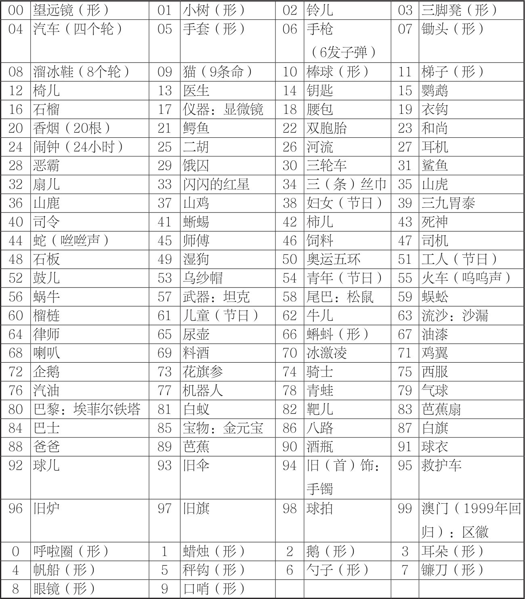

CHAPTER 02

关于记忆法的七大误解

如果你有下面这些特质和心境，相对而言会学习得更好：

1. 保持一颗好奇心，敢于尝试新体验，不断去精进自己。

2. 拥有比较清醒的大脑，能够专注静心去做一件事。

3. 拥有一定的想象力，敢于打破常规去创造。

4. 有明确的学习目标和浓厚的学习兴趣。

CHAPTER 03

学好记忆法的六大步骤

1.“TEFCAS”法则：由世界大脑先生托尼·博赞先生提到，也就是尝试（Trial）、行动（Event）、反馈（Feedback）、检查（Check）、调整（Adjust）和成功（Success）

2.步骤：大胆尝试→积极行动→及时反馈→检查总结→调整改进→迈向成功

3.使用记忆法出现偏差时的“三问”（检查总结）：

（1）.对方法的选择是否有误？

（2）.对方法的理解是否不够？

（3）.怎样在下一次做得更好？

CHAPTER 04

记忆魔法初体验

强化记忆的七种武器

1.形象：画面清晰，细节突出，颜色分明，动感十足，记忆的效果会更加明显。

2.独特：尝试用夸张、幽默、意外等“特效”让记忆更加独特。

3.简单：组块越少，就越简单，记忆起来就更容易。

4.故事

5.逻辑：因果逻辑就是故事的生命线，如果过于超出日常的认知，大脑会自动屏蔽，很难牢记。

6.联结：将两个事物通过逻辑或非逻辑的方式联系起来，由一个能够立即想到另外一个。

7.感觉：感觉也称为感元-视觉、听觉、触觉、嗅觉、味觉，如果能够充分运用，可以帮助我们达到更佳的记忆效果。

CHAPTER 05

常用的四种记忆法

1.理解记忆法

（1）肖卫编著的《魔幻记忆100%》里提到理解与记忆的四种关系是能够理解的未必能够记住；能够记住的也未必能够理解；有些知识只有理解了才能记得牢；有些知识先要记住再去理解。

（2）使用理解来辅助记忆，有以下三种思路：

①通过分析、综合、比较、归类和系统化等思维活动，把握记忆材料的含义、范围和结构层次，从而更利于长时记忆。

②结合已有的知识体系和生活经验，将新的知识变成容易理解的画面。

③尝试用自己的语言去复述知识。

2.规律记忆法

（1）一般规律有以下三大类：要素分析法、正反分析法、国内外分析法。

（2）无法寻找到规律时，也可以创造出规律：

①按照逻辑、字母或空间的顺序，对要记忆的材料进行排序。

②观察共性后进行分类，分类的标准比如大小、构造、材质、轻重、长短、用途、颜色等。

3.组块记忆法

（1）组块是根据意义将信息碎片组成集合，把要记忆的信息加以分类或加工，使之成为一个小的整体，这种记忆方法叫“组块记忆法”。

（2）大脑对正在处理的信息进行瞬间以及有意识加工的这部分记忆，叫作工作记忆。根据心理学家米勒的研究，一般人工作记忆的容量都是7±2个组块，即5~9个之间，这个法则被称为“魔力之七”记忆法则。

（3）基于组块原理，我们在记忆时需要注意以下几点：

①学会发现组块，而非看到就马上死记硬背。

②对庞杂的信息进行分类，将其细分为不同的组块，每个组块的内容控制在7个以内。

③学会对信息进行提炼，把相似的概括成一个组块。

④通过刻意练习加固已有的组块，使记忆更复杂的内容时更容易。

4.比喻记忆法

比喻法步骤：

（1）确定你要深入理解和记忆的信息。

（2）在你的个人经验中寻找与信息相似的东西，哪怕并不是很完美的比喻。

（3）检查比喻，对不恰当的地方进行修正。

CHAPTER 06

六种记忆法

1.形象记忆法：把抽象的信息转化成形象的画面。

（1）静态形象：在观察的基础上，通过视觉残留和语言描述，加上多次检测和强化细节来清晰成像。

记忆训练：从简单的物品开始，慢慢过渡到比较复杂的图案。

（2）动态形象：通过形象活化训练和情境画面冥想训练，从视觉、听觉、嗅觉、触觉、动感全方位去感受形象，唤醒我们大脑的想象力。

记忆训练：形象活化训练、情境画面冥想训练

（3）抽象转形象

①文字转化的技巧：谐音联想、增减倒字、拆合联想、相关联想、综合联想。

②数字转化的技巧：发音、形状和意义。

③图形转化的技巧：整体、局部、纹理、留白、脑补。

（3）想象力的提升技巧

①多看想象力丰富的影视作品或者动画片

②留心观察周边事物，看看像什么

③看小说或诗歌时，在脑海中想象画面，再对照相关的影视作品或者插图

④和小朋友以及想象力丰富的人一起玩耍和交流

⑤做抽象图形的转化训练：整体、局部、纹理、留白、脑补。

2.配对联想法：将两个无关的信息联想在一起。

（1）形象信息配对联想：“找共同点”，包括在音、形、义等不同的维度上。

常用的形象信息配对联想的方法有四种：

①主动出击法：在脑海中分别呈现出两个形象，将其中一个主动对另一个发生动作，使它们彼此接触并且产生一定的影响。在记忆数字时，此种方式用得最多。

②另显神通法：除了运用形象自身的动作之外，还可以借用类似物品的特征动作，进行夸张的联想。

③媒婆牵线法：又称“中介法”，通过一个中间事物将两者建立联想。

④双剑合璧法：将两个物品组合在一起，变成一个新的东西。

（2）抽象信息配对联想

抽象文字信息之间的配对有三种方式：

①关键字组合法：对两个信息都比较熟悉时，可以各自挑选出一个字或多个字，组合起来正好是熟悉的词语或句子。

②先转再配法：先要将抽象文字分别转化为形象信息，再进行配对联想。

③组合转化法：先将两个要记的信息观察分析，看有没有联系，再灵活地进行整体形象转化。

（3）图文信息配对联想

①形象信息配对联想的四种方法：主动出击法；另显神通法；媒婆牵线法；双剑合璧法。

②抽象信息的三种方法：关键字组合法；先转再配法；组合转化法。

3.定桩联想法：将陌生的信息分别与熟悉的有序的信息进行配对联想。

（1）常用顺序

①空间顺序。在熟悉的房间或景点，按顺序找不同的地点或物品，熟记之后即可作为“地点桩/路径桩”；按顺序选择身体的部位来定桩，称为“身体桩”；选择任意物品按顺序拆解成不同部位，就是“物品桩”。

②时间顺序。将按照时间依次呈现的技能操作步骤，分解为不同的动作，作为“步骤桩”。

③常识顺序。熟知顺序且比较形象的常识信息，可以直接作为记忆桩。有顺序但形象性不够的，可以转化之后作为桩子。

（2）如何使用地点定桩法

①打造地点桩

对地点桩的要求：熟悉；有顺序且一条水平线上不超过五个；有突出的形象特征（最好立体）；适中（大小距离明暗角度）等；固定；场景空旷无人不要雷同。

找地点的步骤：概览→确定→回想→记录保存→熟悉→使用。

②使用地点桩：先在脑海中回忆地点，再将要记忆的信息分别转化成形象，主动与地点桩进行配对联想，记忆完毕后尝试回忆还原信息。

③管理地点桩

用本子记录下地点桩，包括在哪里找的地点以及每一个分别是什么。如果条件允许，拍摄成视频和图片版保存。

在使用地点桩时，建议同一组不要一天使用多次，上面的信息容易混淆。

用来记忆需要长期保存的信息，尽量就用专属的地点，以后不要用它来记忆其他信息。

删除地点桩的方式：一是长时间不管它，让其自然地变淡甚至消失，但这个耗时比较久；二是用其他新的信息来覆盖旧的记忆；三是想象地点桩上发了大火或者大水，将这些图像毁灭掉，但这样也会有残留。一般使用前两种方式。

（3）数字定桩法：用数字编码的形象作为桩子

①操作步骤：熟悉数字编码形象，挑选要用的编码，然后参考地点定桩法使用。

②优点：按序号提取时速度快，适合抢答的场合。

③不足之处：数量比较有限，如果用它重复记忆过多类似的信息，也会出现混淆的情况。

<0/></>

（4）熟语定桩法：挑选合适的熟语，每个字分别转化成形象，与信息进行配对联想，尝试进行回忆还原。

4.锁链故事法

（1）图像锁链法：将信息先转化成图像，然后两两之间进行联想，最终像锁链全部串起来。

①核心技法：有具体图像（没有先转化）、两两联结，第一个通过动作联结作用于第二个。

②步骤：转化出形象→按顺序两两联结→尝试回忆并且完善锁链→记录锁链

*在锁链联想的时候，我们要用到图像的特征，作用于下一个图像时，作用在哪个部位，会有怎样的结果，也是要具体呈现的。锁链不要一条直线排列，要有一些高低错落。

（2）情境故事法：将要记忆的信息按顺序编成一个有情节的故事

①原则：简洁、形象、生动、有趣，另外可以加上故事的元素（时间、地点、人物、事件），事件包含起因、经过、结果，让故事可以更容易被回忆起来。

②步骤：概览→尝试→修正→记录。

③编故事常见误区：过多并列信息；过多无关信息；过多场景转换；过多语言陈述；没有融入。

（3）图像锁链法与情境故事法的区别：

锁链法中，每个信息都得是右脑的形象，故事法里，部分可以用左脑的逻辑；锁链法中，任何时候脑海中都只有两个图像，故事法则是一个连贯的情节。将两者综合运用称为锁链故事法。

5.歌诀记忆法

（1）字头歌诀法：一般针对比较熟悉，但需要连串记忆或按顺序记忆的信息。

步骤：熟悉理解→挑取字头（挑选具有提示性的名词或动词）→组成歌诀→意义化（谐音+解释，押韵更好）→回忆→复习。

（2）要点歌诀法：一般常见的是五言和七言。

步骤：熟悉理解→挑选要点→观察信息并尝试编歌诀→回忆还原歌诀→复习。

6.绘图记忆法：只要会画线条和基础图形就可以。

（1）单一图示法：把某一个核心关键词转化成形象并绘制出来的方法，一般五个以内的信息适用此法。

主要用于形象记忆法、配对联想法和简单的字头歌诀法的视觉呈现，也可用于定桩法里的数字定桩法、地点定桩法和熟语定桩法等。

（2）定位图示法：主要是将身体定桩法和物品定桩法进行视觉呈现。

步骤：通读理解，选关键词→构思主图作桩→将文字转成形象，画在主图对应位置→回忆→完善细节。

（3）锁链图示法：主要是将图像锁链法进行视觉呈现。

（4）框架图示法：根据内部的逻辑层次转化成图形示意符号。

八大图解框架模型

①显示出基础层级关系的棱锥型：类似金字塔的形式。

②呈现要素的时间推移的流程型：绘制时一般从左往右、从上往下。

③基于要素的循环反复的循环型

④呈现要素相互依存关系的卫星型

卫星型框架，是指没有主次关系的三个或三个以上独立的要素，以对等的关系保持均衡的框架。

卫星型一般将各个要素通过直线相连，如果要素之间有相互作用，可以用箭头加文字来呈现，

⑤基于元素集合有重叠关系的韦恩型。

⑥呈现统计数据的规律和趋势的图表型。

⑦以要素的横纵两轴的组合呈现的矩阵型

⑧将要素按等级分类的树型

CHAPTER 07

七种常见的信息记忆模型

1.零散信息的散点模型：一般使用形象记忆法，或将词语放入语言情境之中。

2.成对信息的钥匙和锁模型：可以用配对联想。

3.并列信息的花瓣模型

（1）10个信息以内一般以锁链故事法为主。

（2）信息比较多可以分类或分段之后再使用锁链故事法。

（3）并列信息也可以使用定桩法。

（4）如果这些并列信息比较熟悉，且内容很少，比如是地名、食物名等，则优先考虑字头歌诀法

4.顺序信息的排队模型：时间顺序、空间顺序、排名顺序、文本顺序。

（1）顺序信息属于并列信息的特例，使用的记忆方法也比较类似，只是必须按顺序编故事和歌诀。

（2）需要根据考核的方式来确定策略，如果按顺序最好采用定桩法。

（3）如果每一条信息的内容都比较抽象且内容较多，采用定桩法可能要优于锁链故事法。

5.纵横交错的矩阵模型

处理这样的矩阵模型有两种方法：

（1）横向并联式，可以按顺序依次记住每一行的内容。

（2）竖向串联式，首先记住从上到下的顺序，接下来依次记住每一列。

6.阶层化信息的金字塔模型

要记忆这样的模型有两种技巧：

（1）先宏观再微观，或从微观到宏观，灵活使用锁链故事法或字头歌诀法。

（2）利用多层级的定桩系统，比如地点定桩法或数字定桩法。

7.空间位置关系的地图模型

（1）有特征容易记的，单独搞定

（2）如果局部有很多部位且特征不明，可以按照一定的顺序，使用类似于地图的方式巧记。

CHAPTER 09

诗词文章的记忆

 1.汉字音形义的记忆：谐音联想、增减倒字、拆合联想、相关联想、综合联想。

2.文学常识的记忆

（1）作家的字号、别称等：不清楚意义可以用配对联想法。

（2）系列作品：运用故事法。

（3）作品或作家的合称

3.背诵文章

步骤：整