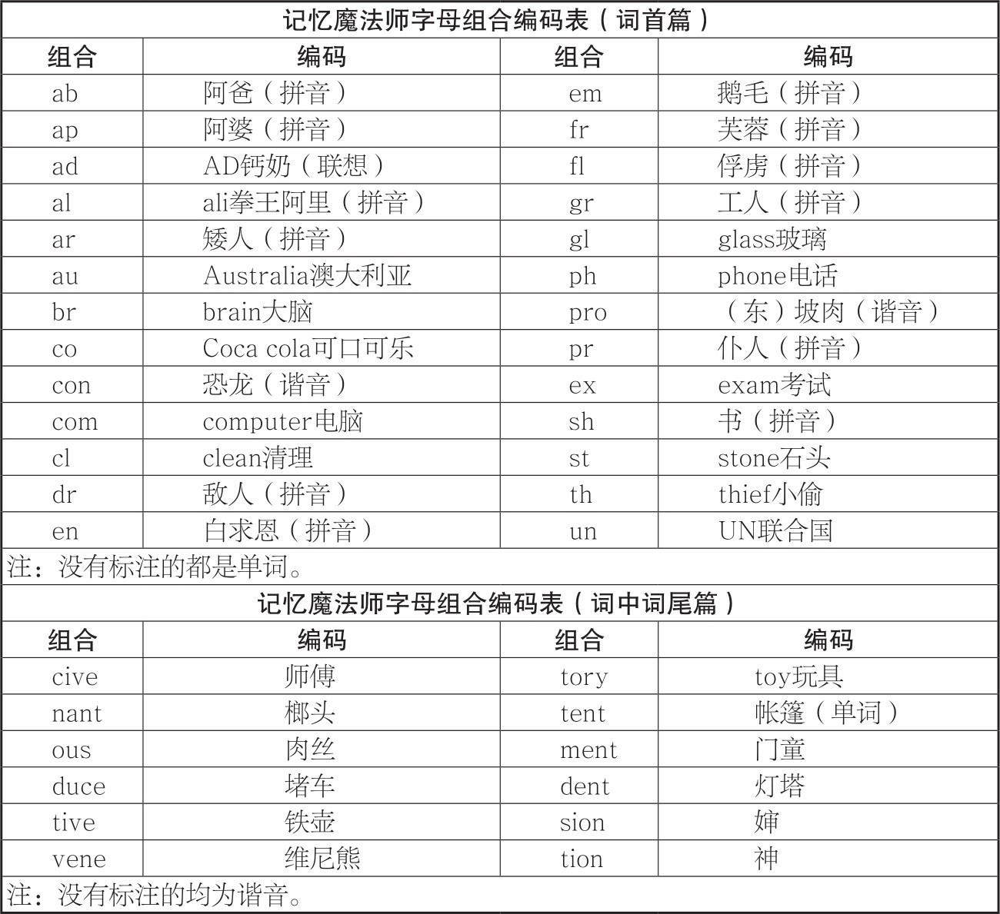
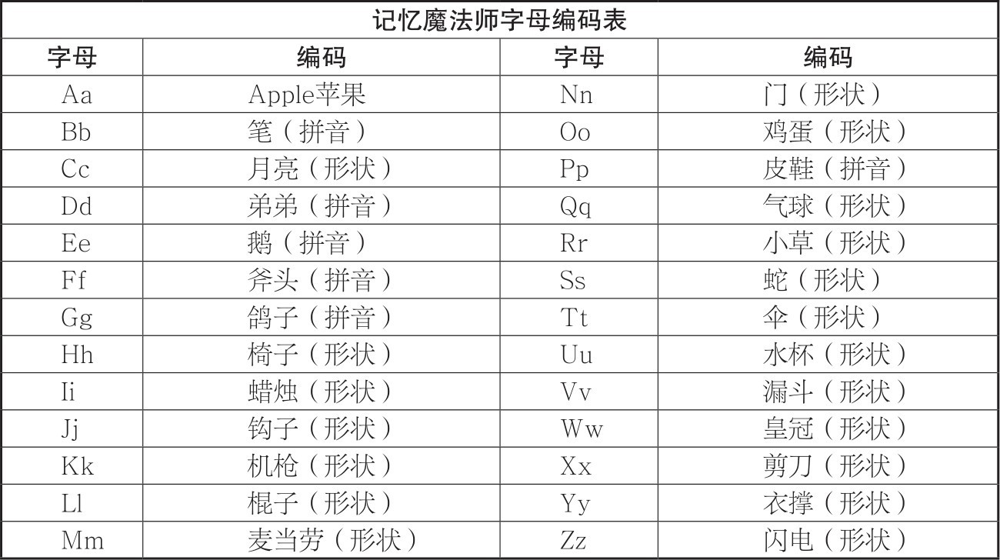

体把握文章→消灭拦路虎（生僻字等）→巧用记忆法（长篇先列提纲，具体段落根据特点使用不同记忆模型）→回忆强化→复习

CHAPTER 10

数字信息的记忆

 1.常数记忆

（1）对小数点编码。

（2）将小数点直接读作“点”，其他的可以谐音或想到熟悉的形象。

（3）在记忆比较少的数字时，直接谐音也是很好的技巧。

（4）可以尝试用空间定位来进行区分

2.号码记忆：谐音法、组块故事法、编码故事法、地点记忆法。

3.历史年代等：随时记忆逐个击破。

另外还可以使用以下的记忆方法：

（1）特征观察法： 整数、重复、对称；顺序、数列；数学计算。

（2）谐音联想法：将数字谐音转化成形象之后，与事件的形象进行配对联想。

（3）编码联想法：将数字分别转化成编码，再使用锁链故事法与事件进行联想。

（4）以熟记新法：参考熟知的历史年代、私人时间、数字代号。

（5）串烧记忆法

①将时间相同相近的串记：时间用谐音，时间编故事或歌诀

②时间间隔串记：隔一年、五年、十年、百年、千年都行，把它们归纳在一起来记忆。

CHAPTER 11

英语单词的记忆

1.常用方法：音标拼读法、五多记忆法（看读听写想）、词根词缀法、谐音记忆法、语境记忆法

*如果是入门者，没有必要使用记忆法，多读多听就好。如果需要记住海量单词，可以尝试这三种单词记忆法：组块故事法、比较记忆法、形近串记法。

2.组块故事法步骤

（1）找到熟悉的组块

①组块类型：词根和词缀、熟悉的单词、熟悉的拼音、定义的编码

②在单词里经常出现的字母组合，将其定义成编码形象，编码方式有：利用谐音；联想到相关单词或形象；利用汉语拼音；形象化。

<0/></>

<0/></>

（2）将拆分的组块和单词的意思，一起编成一个故事。

（3）尝试回忆故事，拼写出单词，并说出单词的意思。

2.比较记忆法：比较熟词记忆新词、差异区分单词、双胞胎词

3.形近串记法

（1）歌诀串记

①结合意思和情境编歌诀。

②结合字形的不同来编歌诀。

（2）故事串记

（3）阶梯串记：在一个单词的基础上，加上一两个字母变成新的单词，然后再加一两个字母又变成新的单词，这样像阶梯一样不断加码。

4.词组的记忆秘诀

（1）情景理解记忆。

（2）对于难以通过介词意思来区分的单词，可以对介词进行形象编码，一般可以借助谐音以及意义。

CHAPTER 14	CHAPTER 15

战胜遗忘的复习艺术             提升智力的脑力倍速术

1.防止遗忘策略：增强动机、积极心态、选择时机、有效复习。

2.寻回记忆策略：转移注意、联想位置、顺序搜索、多线索回忆

3.正念冥想提高脑力

（1）保持脊椎的直立，双手轻轻放在大腿上面，双脚着地平放在地上，然后轻轻地闭上眼睛。

（2）放松身体，保持感官敏锐，听听周围的声音，去感受它们的方向、音调、声色、节奏等，感受身体与椅子接触的感觉，以及手放在大腿上的感觉。

（3）现在专注于你的呼吸，吸气时用鼻子吸气，感受腹部的鼓起，吐气时用嘴巴吐气，感受腹部瘪下去，呼吸时也可以数数，随着练习的熟练，也可以加长呼和吸的时间。

（4）在呼吸的时候如果走神，只需要觉察到自己走神了，然后轻轻地把思维带回到呼吸上来。接下来，深呼吸20次左右之后，我们进入正常的呼吸。

（5）大约5分钟之后，你可以慢慢睁开双眼，轻轻活动你的身体，重新观察这个世界。

4.大脑保健操

（1）大脑按摩：太阳穴、百会穴（头顶的正中间）、风池穴（耳后稍下的位置，即颈后凹陷处）。

（2）脑波振动：大脑活动会产生各种波动，简称为“脑波”。

①坐在椅子上，背部挺直，不要靠在椅背上，也可以盘腿坐在地上。

②闭上双眼，舒服地呼吸，完全放松身体。

③开始温和地左右摆动你的头，颈部发出一些声音是正常的，会随着练习而减少。深深地呼吸，尤其把注意力放在呼气上。

④把注意力放在你的脑干，放在左右转动的中心点上。

⑤想象当你越来越深入地进行摆动时，你的脑干及整个大脑亮了起来。你的头部也可以像点头一样上下动，或者当你更深入地进行动作时，也可以以无限大“∞”符号的形状来摆动。

⑥在几分钟之后，渐渐放慢摇动的速度，慢慢地回到外在的知觉。待完全停止后，深深地用鼻子吸气，慢慢地用嘴吐气。继续闭目一会儿后再睁开眼睛。

（3）单侧体操

5.大脑减压术：音乐减压、肌肉放松、自由书写、兴趣减压、小睡、大声喊。

6.吃出最强大脑

（1）食用高质量的热量食物不要过量。

（2）喝大量的水，避免饮用热量高的饮料。

（3）饮用高质量的精益蛋白质。

（4）食用低糖指标、高纤维的碳水化合物。

（5）限制脂肪摄入，食用ω-3系列脂肪酸的健康脂肪。

（6）进食不同颜色的天然食品来增强抗氧化能力。

（7）烹饪时使用对大脑健康的香料和调味料。

6.运动改造大脑：跳绳、游泳、慢跑、羽毛球。

7.益智游戏：魔方、象棋、数独、九连环。

8.新体验激活大脑

（1）学习和体验新的技能。

（2）突破内心恐惧的行动。

（3）去以前没有去过的地方。

感受：这本书好的点在于方法和实例结合紧密，每章还有总结和练习，方便复习强化，实践性还可以。不过整个看下来，会发现重复性挺高，而且比较枯燥，可以跳读。书上的例子只是用来理解相应的记忆方法和模型，不要直接照搬着记，最关键还是多练习举一反三创造自己的联想和编码等。另外也不能“尽信书”，要结合自己的实际情况，有的不适用不实用的大可不用。