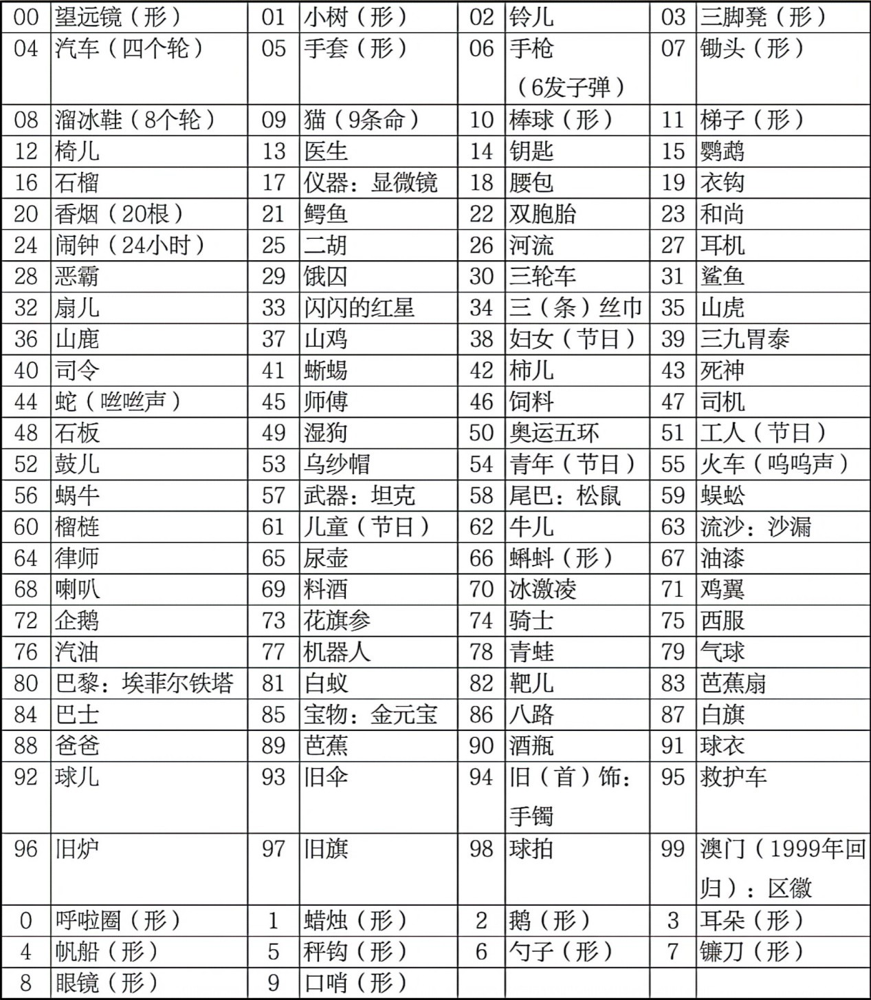

HAPTER 03学好记忆法的六大步骤

大胆尝试2.积极行动3.及时反馈4.检查总结5.调整改进6.迈向成功

CHAPTER 04 记忆魔法初体验

三 记忆的七种武器 

象如果画面清晰，细节突出，颜色分明，动感十足，记忆的效果会更加明显。

独特-用夸张、幽默、意外等“特效”。

简单-“组块理论”

故事-组块更少，有鲜明的场景和有逻辑的情节。

逻辑-过于超出日常的认知，大脑会自动屏蔽。

连结-将两个事物绑在一起 。

感觉-“情绪”是记忆的强化剂。

CHAPTER 05 四种记忆法

一 理解记忆法

所谓“理解”，不仅指看懂了材料，还包括搞懂了材料各部分之间的逻辑关系，以及该材料和以前的知识、经验之间的关系。

通过分析、综合比较、归类和系统化等思维活动把握记忆材料的含义、范围和结构层次，从而更利于长期记忆。

结合已有知识体系和生活经验，更容易理解。

用自己的语言去复述知识。

二 规律记忆法

历史：要素分析法、正反、国内外

逻辑规律

共性

三 组块记忆法

工作记忆在7±2个组块之间

学会发现组块

对信息成分不同的组块，每个内容七项之内

提炼信息，相似的概括成一个

刻意练习加固已有的组块

四 比喻记忆法

又称类比记忆法，把新概念与已有的神经结构联系在一起

有寻找比喻的欲望，确定深入理解和记忆的目标

多加尝试

优化和测试比喻，从多角度比喻，最好让10岁小孩可以听懂

CHAPTER 06 六根魔棒

形象记忆法

静态现象记忆法

想要锻炼形象记忆法，脑海中需要储存大量形象

-魔法练习 照相记忆训练

先从简单物品开始，慢慢过度到复杂

将图画中的每个细节部分和彼此之间的关联性，从视觉画面转变为可描述的文字，这样更易于记忆。

二、动态形象的想象训练

-魔法练习 形象活化训练

三、抽象转形象的训练

抽象文字转化

谐音联想

增减倒字

拆和联想

相关联想

综合联想

抽象数字转化训练

<0/></>

(三)抽象图形转化训练

观察时主要有五个角度：整体、局部、纹理、留白、脑补

配对联想法-提供一项想另一项

形象信息配对联想

主档出击法-主动使一个形象对另一个对另一个形象发生动作

另显神通法-让形象干别的事

媒婆牵线法-

找第三方中介

组合法

抽象信息配对联想

关键字组合法

先转再配法

组合转化法

图文信息配对联想

常见的颜色编码：

红：小红帽、红领巾、红苹果、韩红、血。

白：白云、李白、白酒、白旗、白板。

黑：黑猫警长、墨水、黑加仑、煤炭、乌云。

绿：绿叶、小草、绿萝、绿帽子、绿豆。

黄：黄金、黄袍、小黄鸭、黄昏、皇帝。

蓝：蓝精灵、大海、蓝色妖姬、蓝猫、篮子。

第三节 定桩联想法

魔法小结

定桩联想法是先寻找一系列的桩子，即已经熟悉的、有顺序的、有特征的一系列形象，然后把需要按照顺序记忆的信息，分别和每一个桩子进行配对联想。本节主要讲解了地点定桩法、数字定桩法、熟语定桩法三种方法。

➤　地点定桩法

地点桩的黄金五法则：熟悉、顺序、特征、适中、固定。

寻找地点桩的步骤：概览、确定、回想、记录、熟悉、使用。

使用地点桩的步骤：先在脑海中回忆地点，再将要记忆的信息分别转化成形象，主动与地点桩进行配对联想，记忆完毕后尝试回忆还原信息。

管理地点桩的方法，关键在于怎么保存地点桩，如何消除地点桩上的记忆痕迹，以及长期使用地点桩后如何修复。

➤　数字定桩法

使用数字编码分别和信息进行联想，按序号提取时速度快，适合需要抢答的场合。

➤　熟语定桩法

挑选合适的熟语，每个字分别转化成形象，与信息进行配对联想，尝试进行回忆还原。

定桩联想法是一个神奇的方法，也是世界记忆大师最常用的方法，特别是对于海量信息的记忆，比如将一本国学经典或英汉词典任意点背。但其难点在于，我们需要提前去打造这个储存记忆的硬盘，有些同学没有时间或者足够的动力去打造，或者觉得寻找桩子好麻烦，最终可能就放弃了这种方式。请记住，磨刀是不误砍柴工的，没有开始的麻烦，就没有后来的轻松。

锁链故事法主要分享了图像锁链法和情境故事法两种方法，通过一定的方式将要记忆的内容串联起来，达到一记就记一串的目标。

第四节 锁链故事法

➤　图像锁链法的步骤：

第一步：在脑海中转化出形象。

第二步：按顺序两两联结，在脑海中呈现出来。

第三步：尝试回忆并且完善你的锁链。

第四步：记录下你的图像锁链联想。

➤　情境故事法的步骤：

第一步：概览。

第二步：尝试。

第三步：修正。

第四步：记录。

➤　编故事的常见误区：

1. 过多并列的信息。

2. 过多无关信息。

3. 过多场景转换。

4. 过多的语言陈述。

5. 没有融入其中。

➤　图像锁链法与情境故事法的区别：

锁链法中，每个信息都得是右脑的形象，故事法里，部分可以用左脑的逻辑；锁链法中，任何时候脑海中都只有两个图像，像是两两合影的照片，故事法则是一个连贯的情节，像是一部电影或动画片。一般我会将两者综合运用，称为锁链故事法，不管黑猫白猫，能抓住老鼠的猫才是好猫。

第五节 歌诀记忆法

魔法小结

歌诀记忆法是将要记忆的信息进行精简浓缩，组合成有意义、有韵律、有趣味的顺口溜、口诀等形式，让我们通过声音的刺激达到牢记的效果。歌诀记忆法最常用的有两种形式：字头歌诀法和要点歌诀法。

➤　编字头歌诀的步骤是：

第一步：熟悉理解。

第二步：挑取字头。

第三步：组成歌诀。

第四步：意义化。

第五步：尝试回忆。

第六步：复习强化。

➤　编要点歌诀的步骤是：

第一步：熟悉理解。

第二步：挑选要点。

第三步：观察信息并尝试编歌诀。

第四步：尝试回忆，还原歌诀。 

第五步：复习强化。

第六节 绘图记忆法

魔法小结

绘图记忆法是将抽象的信息转化为形象之后，用简笔画的方式呈现出来的方法，也称为“图示记忆法”，本节主要分享单一图示法、锁链图示法、定位图示法、框架图示法四种方式。

➤　单一图示法，即给单个孤立信息配上一张插图的方法，主要用于形象记忆法、配对联想法和简单的字头歌诀法的视觉呈现，也可用于定桩法里的数字定桩法、地点定桩法和熟语定桩法等。

➤　锁链图示法，主要是将图像锁链法进行视觉呈现。

➤　定位图示法，主要是将身体定桩法和物品定桩法进行视觉呈现。

➤　框架图示法，主要分享了八大图解框架模型：

1. 显示出基础层级关系的棱锥型。

2. 呈现要素的时间推移的流程型。

3. 基于要素的循环反复的循环型。g

4. 呈现要素相互依存关系的卫星型。

5. 基于元素集合有重叠关系的韦恩型。

6. 呈现统计数据的规律和趋势的图表型。

7. 以要素的横纵两轴的组合呈现的矩阵型。

8. 将要素按等级分类的树型。

如果说前面的几根魔棒是相机的胶片，全靠在脑海中想象，绘图记忆法就像是冲洗照片，虽然不可能百分百呈现脑海中的形象，但是通过直观的方式呈现出来，会让我们的印象更加深刻。在这里再次强调，画得美与丑并不重要，关键是能够帮助我们记住，“内在美”才是真的美。

CHAPTER 07 七种常见的信息记忆模型

第一种模型：零散信息的散点模型

即记忆学习和生活中孤立存在的零散信息(专有名词、生僻字)的模型。对于散点模型的文字信息，一般使用形象记忆法；另一种方式是将词语放入语言情景中(学习外语单词或方言词汇)。

第二种模型：成对信息的钥匙和锁模型。

使用“配对联想法”。在考试中，较为典型的题型是选择、填空和问答。

第三种模型：并列信息的花瓣模型

针对并列信息，10个以内的，一般以锁链故事法为主，如果量比较大的话，可以分类或分段之后再使用锁链故事法。当然，并列信息也可以使用定桩法，虽然并没有要求记住顺序。如果这些并列信息比较熟悉，且内容很少，比如是地名、食物名等，则优先考虑字头歌诀法。

第四种模型：顺序信息的排队模型

时间顺序对应“八大图解框架模型”流程图

顺序信息是并列信息的特例，方法类似，只是必须按顺序编故事和歌诀。另外还需要根据考核方法确定策略；如果每一条信息的内容都比较长和抽象，采用定桩法优于锁链故事法。

第五种模型：纵横交错的矩阵模型

对应“八大图解框架模型”中的矩阵型，分为横向并联式和竖向串联式。另外，知识比较表格也属于矩阵模型，比较简单的可尝试“理解记忆法”和“规律记忆法”。

第六种模型：阶层化信息的金字塔模型

对应树形。除了在重点部位使用插图强化以及结合理解记忆，还可以灵活使用六根魔棒。

先宏观再微观，灵活使用锁链故事法或字头歌诀法

利用多层级的定桩系统，如地点定桩法或数字定桩法

第七种模型：空间位置关系的地图模型

可借助每项间的位置关系，切割成局部分别记忆。有特征很容易记的单独搞定，如果局部有很多部位且特征不明，可以按照一定的顺序，使用类似地图的方式技巧灵活记忆。

CHAPTER 08 语文基础知识的记忆

汉字音形的记忆：理解记忆或联想记忆

字型、字音都陌生的疑难字 

字型、字音都很像的易混字+

发音容易读错的汉字

容易产生误读的多音字：只在特殊情况下发特殊音的，记住特殊；根据意义、词性、语境有不同发音规律的，找到规律；同时有很多读音的，通过歌诀或故事串联典型词

成语里的错别字

相近词语的词义辨析

文学常识的记忆

记忆作家的名字、别称：1.有些作家名与字相同或相近2.配对联想法3.编歌诀一网打尽

记作家的系列作品-想象，故事记忆法、字头记忆法

记作品或作家的合称-想象，故事记忆法、字头记忆法

CHAPTER 09诗词文章的记忆

步骤

第一步：把握整体文章——核心主题、逻辑结构、表达方式，边阅读边想象，一遍两遍即可

第二步：消灭拦路虎——生僻词句，理解无法记牢可采用记忆法

第三步：巧用记忆法——梳理提纲，各个击破

第四步：清理死角

第五步：科学复习——每段巩固两遍再背下一段、全部完毕后再整体背诵几遍

方法

形象记忆法——针对比较形象且有情节的写景或叙事的部分

细节部分措辞可单独添加形象，一般都可用绘图呈现

锁链故事法——句式基本同样的，只需要将不一样的部分记住，可以先用下划线标出来；另一种情况，前一句和后一句逻辑联系不紧密，容易忘记下一句开头。可使用形象记忆法，两句头尾形象建立连结。

字头歌诀法——针对容易提炼出关键字的并列信息还可以使用用字头歌诀法记忆，也可将后面的字也按顺序编入歌诀。可建立“矩阵模型”，方法：先横后纵、横向记忆（串联关键词成歌诀或故事）。

定桩记忆法——在比较长的古诗和文章里，辅助记忆句与句间的顺序。把多长的内容放在一个桩子上由定桩法水平和诗文熟悉程度决定。

综合运用法——第一步是整体把握文章，第二步是消灭拦路虎，第三步是巧用记忆法，第四步是清理死角。