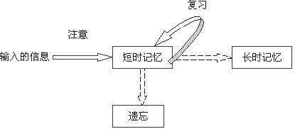
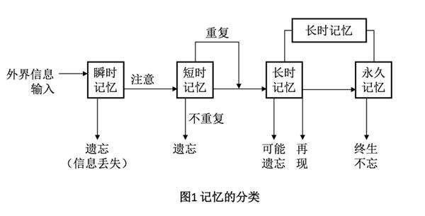
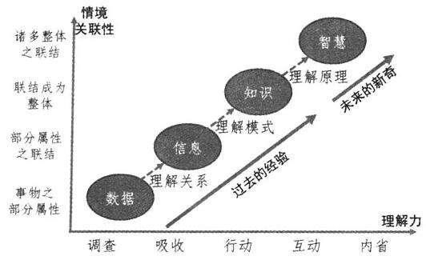
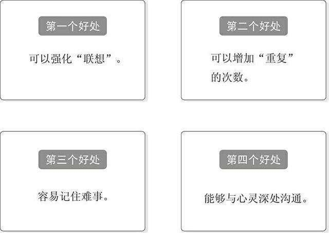
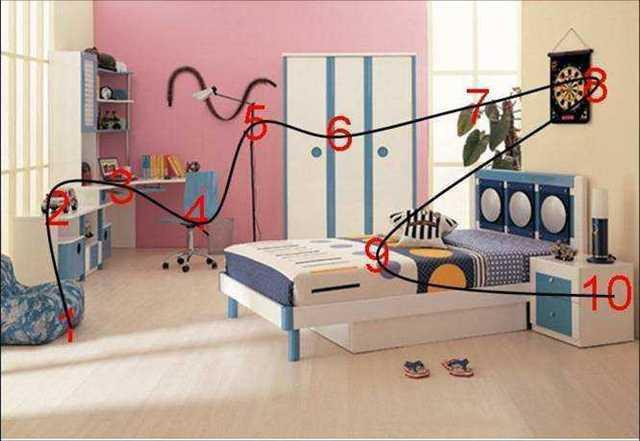
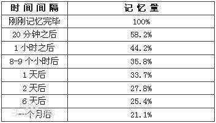

<0/></>

记忆，就是我们大脑接受、储存和使用的过程。

从心理学的角度来看，记忆代表着一个人对过去活动、感受、经验和印象的累积；通过对记忆的搜索，我们会把有用的信息提取出来，以此解决相关问题。

而一般来说，<u>我们的记忆可以分为三种：</u>

<u>1，瞬间记忆；</u>

<u>2，短期记忆；</u>

<u>3，长期记忆；</u>

这三者之间存在的密切的关系：对外界的接触而获得瞬间记忆，对其赋予效用后，变成短期记忆，再通过反复使用短期记忆，那么以此获得的信息就会变成长期记忆，长久地储存在我们的大脑当中。

对于学习来说，长期记忆起到至关重要的作用。但想要把短期记忆转化为长期记忆，很多人往往喜欢通过一些死记硬背式机械记忆方法去学习。

其实，这种低效的记忆方法，反而会让我们忘得更加快，难以形成稳定的长期记忆。

因此，我们只有学会科学的记忆方法，才能够快速高效地记忆知识，进而取得事半功倍的学习效果。

<0/></>

### **01.**

### **什么是科学记忆？**

想要掌握科学的记忆，就首先了解一下什么是“科学记忆”。

科学记忆法，指的就是运用科学知识，确切认知和了解记忆的原理、遗忘规律，然后再结合自身学习情况而形成的高效记忆方法。

我们无论学习什么，看书也好，提升自己的能力也罢，通过科学记忆法去记忆学到的内容，我们更能够掌握到知识的核心和运用。

而“科学记忆法”，<u>常用的方式有三种：</u>

<u>1，理解记忆法；</u>

<u>2，联想记忆法；</u>

<u>3，具象记忆法；</u>

在我们学习的时候，根据自身的学习内容，懂得交错使用这三种记忆方式帮助自己去记忆知识，我们就的学习就更有效果，记忆也会更牢固了。

只要有意识去运用科学的方式去记忆，你很快就会变成一个学习高手。

<0/></>

### **02.**

### 

### **通过理解的方式去记忆**

研究表明，人类对于自己所理解或认同的事物，更加容易去记忆。

当你学习某些知识的时候，先把内容的核心主旨和逻辑关系弄清楚，直到你的大脑掌握到知识的“前因后果”，你自然而然就把知识记忆在脑中了。

但是怎么做到“理解”知识呢？毕竟每个人的理解能力，并不是都高到就能轻松消化学到的知识。

这就要根据知识的不同类型，针对性去理解，然后记忆了。

美国著名教育学家布卢姆提出的<u>四大知识类型</u>，他把知识分为四类：

<u>1，事实性知识</u>（factual knowledge），直接描述事实的内容；

例如太阳从东边升起，西边落去；水是由氢、氧两种元素组成的无机物；美国目前人均GDP比中国高很多等等。

<u>2，概念性知识</u>（conceptual knowledge），某些观点或现象的原理总结；

例如经济学的概念“沉没成本“、“需求定律”；心理学的“第一印象效应”，“罗森塔尔效应”等等。

<u>3，程序性知识</u>（procedural knowledge），是如何做“事”的知识，需要遵从一定的步骤；

例如通过做手工设计出一个作品，需要经过哪些步骤，那每一个步骤组合起来的知识，就是程序性知识。

<u>4，元认知知识</u>（metacognitive knowledge），是关于一般的认知知识和自我认知的知识；

这种知识在此暂且不表。

而在这四种知识当中，概念性知识是我们进行理解的第一步，也是理解的基础。

不管你是通过什么方式去学习，听课也好，看书也罢，当你能够从学习内容当中建构出意义时，那你就算是理解了。也就是说，你让“新知识”跟大脑重的原有知识产生关联时，你就产生了理解。

而理解的方式，包括以下几个方面：

<u>***第一，解释知识。***</u>

将接受到的信息，从一种表征方式转换成另一种表征方式，就是理解的过程。

例如“沉没成本“这个概念，”是指以往发生的，但与当前决策无关的费用。当我们接收到这个信息之后，能够用自己的语言去解释它，如“一些已经付出，而对当前事情不会产生影响的费用”，那就说明你已经在理解它了。

<u>***第二，举出例子。***</u>

针对概念，举出相关的例子。例如你去看电影，买了一张电影票，没想到临开场之前，电影票丢了，那么“丢失的电影票”，就是属于沉没成本。

那么你要不要继续看电影，就不能以这个沉没成本去影响自己的决策。决定你要不要继续看电影的，是你想不想和有没有足够的钱财去买票看，这个决策并不是建立在“丢失的电影票”这个沉没成本之上。

<u>***第三，知识分类。***</u>

这是构建知识体系的一步。

当你懂得把学会的概念，分到某个知识范畴的类别，说明你已经知道这个知识的应用范围和应用对象了。

很明显，“沉没成本”这个知识概念，是属于经济学上的概念，而这个概念，跟我们生活上的“经济行为”有密切关系。

当你把这些知识分类到“经济行为”这个范畴中，你自然就懂得在日常生活中运用这种知识了。

<u>***第四，总结概括。***</u>

懂得对知识总结概括出核心主旨。

当你学到一个知识，你能够用一句话或者一个关键词把这个知识总结出来吗？你知道某篇文章主要是阐述什么观点吗？你能不能提取出精华，让知识更容易理解呢？

总结是理解的重要步骤。如果你无法对学到的知识用自己语言概括出来，说明你还没有真正理解到知识的含义。

当然除此之外，还有<u>其他方法</u>。如<u>比较不同知识的关联之处</u>，<u>推断出新知识和旧知识之间的逻辑关系</u>，甚至<u>构建出自己对概念的模型</u>等，都能够从不同的维度去理解知识，消化知识，重塑知识。

<u>**简单一句就是，学习就要善于思考，懂得举一反三。只要这样去理解知识点，你才能够把它记在大脑里。**</u>

<0/></>

### **03.**

### 

### **运用联想让知识跟外界联系起来**

### 

联想记忆法，就是利用识记对象与客观现实的联系、已知与未知的联系、材料内部之间的联系去记忆的方法。

简单来说，就是<u>利用两个事物之间的共同点进行记忆的一种方法</u>。如果你能够把<u>学习内容与自己的亲身经历衔接</u>在一起，记忆效果就会更好。

美国记忆大师哈利·洛雷曾经说过：“记忆的基本法则，就是由新的信息联想于已知的事物。”这句话就说明了联想记忆，重在新旧知识之间的关联。

在运用联想记忆法的时候，一般都有两种应用方式：

<u>***第一种，相似联想记忆；***</u>

根据事物之间在性质、成因、规律等方面的相似之处，而建立起来的记忆方法。

例如想记忆“沉没成本”这个概念，那么我们中文所说的“覆水难收、木已成舟”等，都有一定的相似性，都表示事情已经发生，无可挽回。

只不过“沉没成本”还要进一步表达，不要被已经发生的事情影响到将来的决策而已。但通过相似性联想，你就更容易记忆这个概念了。

<u>***第二种，对比联想记忆；***</u>

根据两件事之间的明显不同特征，加以联想的记忆方法。通过对比事物之间的差异，从而掌握各自的特点，起到记忆的作用。

例如经济学上有“滚雪球效应”这个概念，而在哲学上有“滑坡谬误”这个概念，这两种都表达一个从高往下发展的态势。

但前者表达的是“优势累积”，而后者则是“不合理的叠加”，所以最终表达的意思也就截然不同。

通过这样的对比，我们对于这些概念的记忆也会更加深刻。

<0/></>

### **04.**

### 

### **让记忆知识具体化起来**

### 

具象记忆法，就是在记忆过程当中，<u>运用脑海中的直观形象，采用形象思维</u>，以此达到提高记忆的效果。

我们对于那些看过、听过、亲身经历过的事情，会记得比较深刻，就是因为这些事情有一个具体的画面点，当我们回忆这个画面点，自然就把相关的东西回忆起来了。

17世纪捷克教育学家夸美纽斯曾说过：“凡事需要知道的事物，都要通过事物的本身来进行教学。也就是说，应该尽可能把事物本身或者替代它的图片放在学生面前，让学生更直观地看、去摸、去问闻等。”

这就是具象化记忆的核心宗旨了。

其中，宫殿记忆法，算是具象化记忆的一种比较有用的方法。

<0/></>

运用宫殿记忆法，大概有四步：

<u>***1、构建宫殿。***</u>

这个“宫殿”，可以是你的房间，你的课室，你的办公室等，只要这些地方是你熟悉而且布局分明的，那么你就可以以此构建宫殿的框架。

你需要根据宫殿的框架，找到一些比较突然物品，然后设定一个具体的行走路线。按照顺序，从外往里走，都有什么东西，这些东西都放在什么地方，尽量选择一些不太会变动的物品和位置。

<u>***2，提取关键词。***</u>

把学到的知识点，浓缩成关键词来记忆。

只有你对内容有过理解，你可以通过提取关键词去回忆出大致的内容。这些关键词可以是书里面的，也可以是你自己总结提炼的。

<u>***3，具象化联想。***</u>

例如你把“沉没成本”这个概念，跟放在房间桌子上的“剪刀”联想起来，说明一些东西被剪刀剪碎之后，就无法复原，对应概念的意思。

在联想的时候，越能调动自身<u>情绪</u>，想象得越是<u>奇特</u>，就越容易记住，因为大脑对于与众不同的东西会特别有注意力。

4<u>***，回忆知识。***</u>

当你把学到的知识点都放在记忆宫殿后，那么你就要想象自己进入宫殿，每当经过一个物品，都要想出对应的知识点。

好比当你看到桌子上的剪刀时，你就能够回忆起“沉没成本”这个概念，其他知识如此类推，直到自己完全回忆起来。

“记忆宫殿”，就是一种比较具象化的记忆方式，让我们置身于某个具体的环境当中，利用场景中的不同物品，去唤醒自己的记忆。

这样的记忆，就会更直观，也更容易回想起来了。

<0/></>

### **05.**

### 

### **掌握记忆与遗忘的规律**

### 

掌握记忆的规律，可以让我们的学习变得更加高效。

研究表明，每次信息的输入，其记忆时间的长短也会不一样。如果每次你都是长时间去接触一个信息，这个信息就很容易转化为长期记忆。

可以说，从短期记忆到长期记忆，这需要一个转化的过程。而这个过程你投入了多少时间，就决定了所信息能不能被牢固记住。

所以为什么复习会如此重要？就是因为复习就是一种重复接触信息的方式，让我们有更多的时间去梳理知识。

这就需要我们根据记忆的遗忘规律去学习了。

想要有效地提升我们的记忆力，我们可以采取以下这些策略：

<u>1，学完一个知识后，在短时间内对知识进行一次系统的总结与归纳，让知识形成内在的衔接关系。</u>

<u>2，把一些难以记忆的知识，写在一个本子上，或者利用现代化手段，时时刻刻加深大脑对此的印象。</u>

<u>3，尽量把学到的知识跟现实生活中的事情联系起来。只要学到的知识跟自己的生活有亲身的经历，你才能够牢固记住它们。</u>

<u>4，用自己的语言梳理一遍学到的知识。试着自己给自己“讲课”，在理解的前提下，用自己的语言复述一遍知识，调动自己的五官去感受知识，就很容易记忆了。</u>

通过这些方式去学习知识、记忆知识，我们的学习效率就会大增。