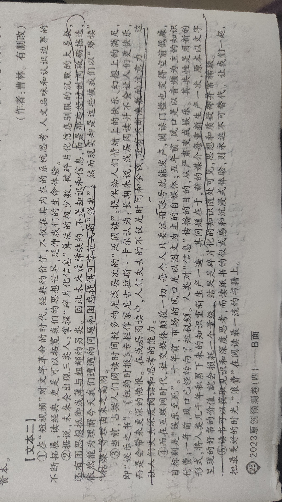

看学者刘擎一篇文章，谈到“忍受枯燥”这种能力，特别有道理，他说，如果同学们在娱乐文化的背景下成长，他们能忍耐一个没有笑点，没有兴奋，没有生动言谈方式的时间非常短。他们的阅读能力也在下降，手机上短平快的东西破坏了深度阅读的能力。我们的大学模式是建立在20世纪中叶的文化环境里，假设你能专心致志地读书，能够忍受表面上枯燥但实际上有深度的内容，肯定很有收获。但现在整个文化环境改变了，年轻人对“枯燥”的忍受力非常低。

　　确实，生活在消费主义和娱乐化环境中的一代人，被“精彩”惯坏了，越来越失去忍耐枯燥、在枯燥中学习知识的能力。人们热爱爆梗、段子、金句、笑点，生动、抖包袱的感官刺激。习惯被消耗自己时间的娱乐文化所喂养，学习感官已经钝化，进入不了越过枯燥门槛而深度学习的境界。学习越来越依赖如社会学家伯格曼所说的各种装置范式，这些阅读装置以友好而人性化的方式帮你消除各种“枯燥”，将费力的文字转化成轻松的视听语言，植入笑点，人人面前一台可供随时切换的电脑。这些让你从枯燥中解放的学习装置，实际上已经不是学习，而让学习成为一种信息消费的景观。这种“学习景观”生产着让人躁动和焦虑的欲望，而不是用厚重的知识思想去驯服欲望，并让人安静下来。

　　能真正滋养一个人的事，往往都带着某种枯燥，需要学习者忍受，投入深度注意力去穿透抽象。写作的开始，是枯燥的。阅读一本经典，是枯燥的。深刻的课堂，是枯燥的。创新创造的过程，往往也是枯燥的。枯燥是一个门槛，为不学无术、浮躁者、消遣者设置的障碍，越过这个门槛，沉浸其中，才能慢慢获得愉悦。精彩，不是一个“被动获得”的结论，不是让别人给你喂养，一下子就提起你的兴趣，而是在孤独静观、克服枯燥后先涩后畅，在读懂读通，习得新知，打通困惑后所获得的知识愉悦感。<u>很多人特别喜欢那种无须自己投入多少理解力的“精彩”，上来就是高潮，开口就是金句，那只是娱乐和商业对你的消耗，而不是可沉淀、可致知的思想。</u>

　　写作是一件需要忍受枯燥的事。常有学生跟我说，我为什么不写，因为没有灵感，等有灵感的时候再动笔。我说，哪能这么被动等灵感？你得现在就思考和动笔。开始肯定是一个枯燥的过程，我的经验是，克服了开始30分钟的枯燥，逼着自己动笔，想着想着，就进入状态并找到灵感了。一气呵成，很少是那种一开始就有写作冲动的，而是在克服开始那30分钟的枯燥过程酝酿出来的。伟大的记者李普曼一生创作1000余万字，这需要克服枯燥的强大意志。李普曼初出道时，他的老师威廉·詹姆斯就教育他对自己要有所强制：一个作家每天至少要写1000字的东西，不管他是否愿意，甚至不管他有无东西要写。

　　阅读是一件需要忍受枯燥的事。你要有耐心让自己慢下来，坐得住冷板凳，忍得了枯燥晦涩，去获得这个阅读资格，而不是看一两页就轻易扔一边。再深奥难读的书，克服了前30页的阅读痛苦，坚持一小时慢慢读进去了。前30页往往是作者设的障碍和门槛，一个优秀的作者也是在寻找优秀的读者，绝不希望自己的作品被一个不学无术的人糟蹋。很多人的问题在于，容易被书的标题吸引，却连30分钟的耐心都没有。那些让人很舒服、不断点头的轻松阅读，往往是重复你既有认知的无效阅读，要想获得认知增量，需要艰难的“入境”，需要烧脑的坚硬阅读。

　　上一门好课也是需要忍受枯燥的。常听学生说，某某课是好课，老师善于讲段子；某某课太枯燥，全是抽象的概念和艰涩的推理。我说，判断一门课的好坏，绝不能用“能不能在10分钟内吸引我”的消费者自负去判断，那是对好课的侮辱。首先要清楚，自己是不是需要这门课去完善知识体系，提升自己的思想？学生与老师并不是“我花钱让你教我知识”的消费关系（流行的知识付费异化了教育关系），身心投入学习过程才会有收获。

　　第二要有忍受枯燥的心理准备，投入和参与进去。知识的传授本身就带着枯燥。逻辑推理，方法训练，批判性思考，需要自己琢磨、分析、深思、质疑、否定才能内化，主动探索而不是被动投喂。把课堂当成在德云社嗑着瓜子、翘着二郎腿、后仰着身子等“包袱”，那能学到什么？课堂学习应该是一个把身子往前倾、坐冷板凳、主动致知（knowing）的过程。摆脱那种听奇葩大会看脱口秀综艺的消费感，试着忍受前30分钟的枯燥，才会有所收获。

　　枯燥是一个门槛，庸人越不过门槛，睡着了，或者被电脑上的综艺和手机上的段子吸引走了，谋杀了时间。优秀的人忍耐了前30分钟的枯燥，沉浸到写作、阅读和课堂之中，日积月累，就有了学霸与学渣、人才与人手的分别。所谓优秀，绝不是机巧式小聪明，背后必有强大的枯燥忍耐力，是聪明人下笨功夫，越过了枯燥并攀登到知识高处的结果。

　　什么是拖延症？我在课堂上跟同学们分享过克制拖延症的方法：忍受10分钟的枯燥，就战胜了拖延。迎合你欲望的事，从无须拖延，反要考虑“延迟满足”（实际上，延迟满足也是努力忍受相对于即时满足的枯燥性）。需要拖延的事，开头往往有一定的枯燥性，让人不想动手只想往后拖，枯燥让人望而生畏。强大自律的支配下，立刻着手去做，10分钟迈过去，接受了这个事情，进入做事的“心理场”，从中享受到成就感，受到“行动正反馈”激励，停都停不下来了。

　　好习惯的养成，也是克服枯燥的过程。运动，学英语，坐地铁时读书而不是刷短视频，睡前读几页书而不是刷短视频，会议间隙写几段文字而不是刷短视频。有了想法立刻记下来而不是“等会儿记下来”，多个动作，动笔去记，而不是相信记性或指尖。刚开始总有点枯燥，有了近一个月的积累，回过头去看，有了受益感，进入身体本能，就成习惯了，终生受益。

　　专业训练的过程，哪一个不是克服枯燥的过程？史学家桑兵说，长时间不断重复的、枯燥乏味的基础性练习，是培养兴趣逐渐变成内行不可或缺的必由之路。弹钢琴，学历史，读哲学，读文献写论文，写一手好字，成为专家，每一项令人景仰的成就、受到业内外肯定的专业人士的背后，都经历过常人无法忍受的枯燥。你看到的有趣好玩，那是别人专业积累之后游刃有余的从容驾驭。创新，不是脑袋一拍灵机一动，新点子就来了，那是枯燥的重复实验、头脑风暴、文献输入、失败沮丧、爬起来继续干而不断累积的产物。专业学习和训练，本身就包含着克服外行人无法忍受的枯燥、读普通人永远不会读的东西，做一般人受不了的重复训练，站到其他人的肩膀上，从而拥有了不可替代的专业资本，超越“人手”成为“人才”和“人物”。

　　看看那些能成就人滋养人、在哪里都能受到推崇的好品质，多跟“忍受枯燥”相关。延迟满足、专注、自律，核心都是对枯燥的克服。勤奋，刻苦，深刻，耐心，坚强，钻研，节制，谨慎，惜时，坚毅，慎独，忍耐，适应，仔细品其中都能看到对枯燥的超越，接受和越过枯燥，才能抵达这些滋养人格和意志、让人受益终身的好品质。

　　很多时候，人们对“有趣”的追求中隐含着不愿投入枯燥忍耐的沉浸过程，一下就抵达“感官的愉悦”，这是肤浅之源。所以我觉得，应该珍惜那些考验你枯燥忍耐力的挑战，警惕迎合和喂养，第一份工作最好找一个能训练你枯燥耐受力的岗位，积累从容驾驭各种挑战的资本。如今很多所谓“学习”，已经脱离了真知的求索而成为保健按摩式，营造知识得到幻觉的商业娱乐。不是让你克服枯燥去获得新知，而是迎合着你“厌恶枯燥”的惰性，把需要硬啃的知识，再生产为表面有趣却失去原质营养的“知识点”“金句”“成功学鸡汤”。这实际上不是滋养，而是娱乐工业对你的消耗，消耗了时间、金钱和意志。他们席卷金钱一笑而过，你却在傻乐中成为废人，对“精彩”刺激的要求越来越高，对枯燥忍受的阈值越来越低。

　　我常跟学生讲，学习就是学习，娱乐就是娱乐，想娱乐，那就好好玩，投入地玩。学习就是学习，不要机巧地伪装，美其名曰“娱乐式学习”。读书，尽可能去读严肃的文字，经典，原著，干货，在孤独的沉浸和默读中收获新知，并通过“输出”去固化它，在克服枯燥中获得一手的、上等的知识，而不是等着别人把你当宝宝、喂那种添加各种甜味剂、哄着你惯着你的“知识营养品”。（曹林）

<0/></>