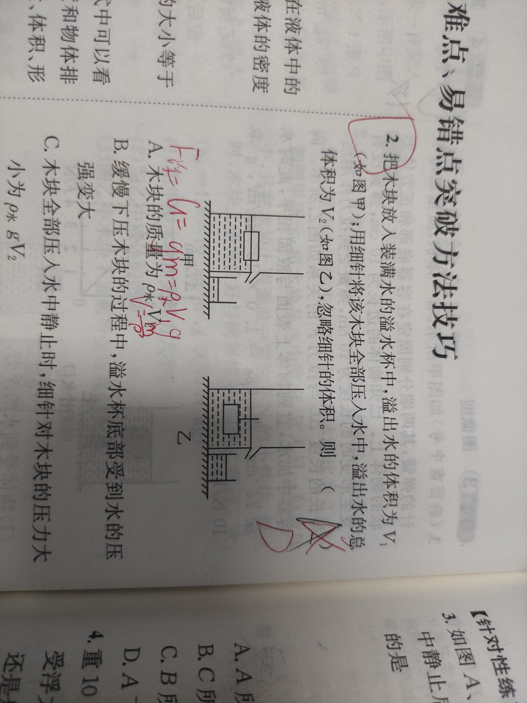<0/></>

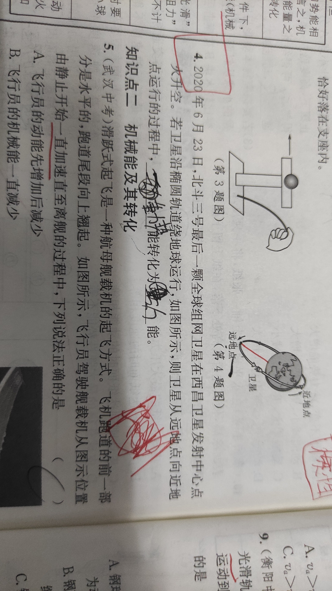<0/></>

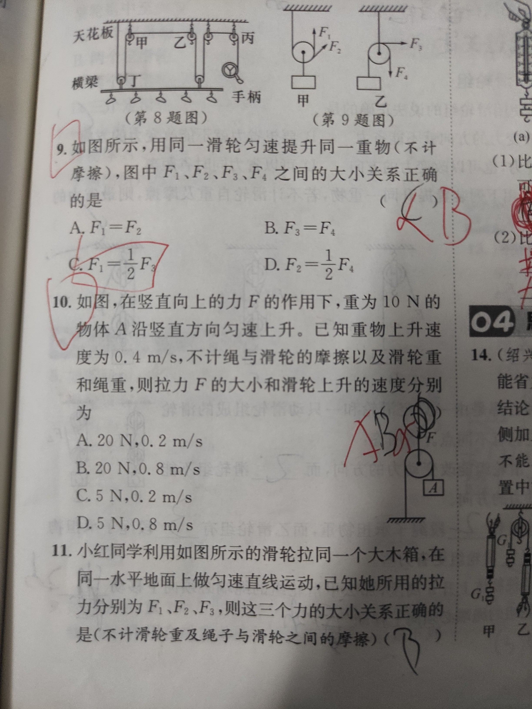<0/></>

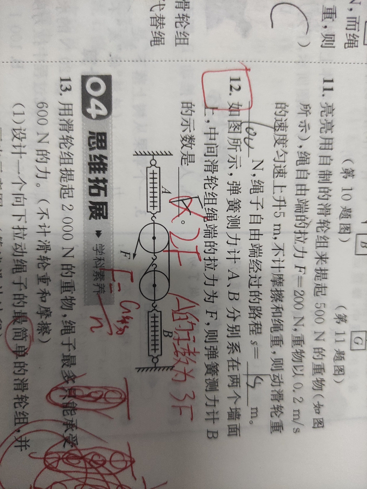<0/></>

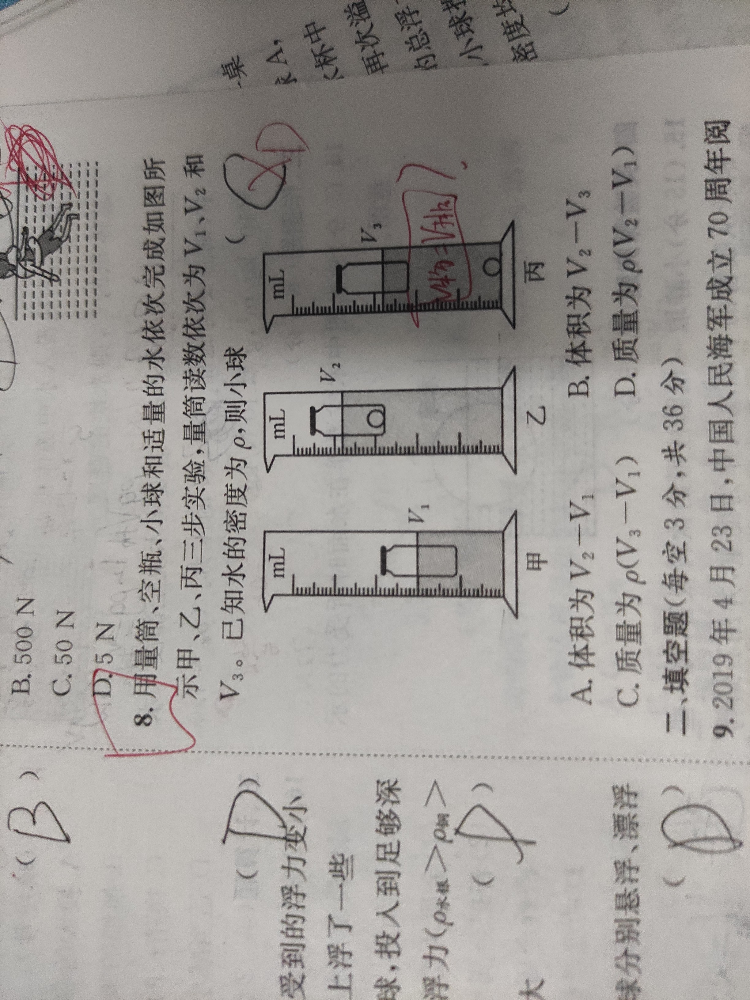<0/></>

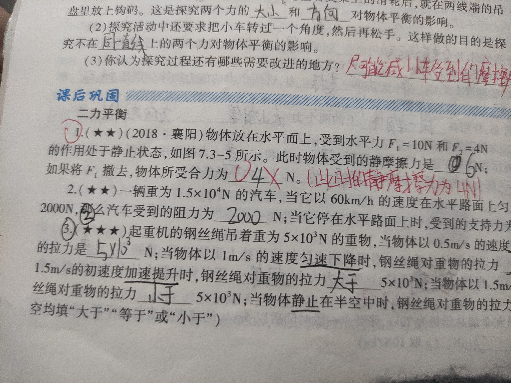<0/></>

<0/><还是液体压枪的问题。P＝F/S＝G/S＝ρvg/s＝ρgh。液体压强只与液面高度有关，与容器形状无关。如果底面积和高度相同，上宽下窄和上窄下宽的两个容器，重力不同，压强为什么相同。/>

上面推到过程应该是错误的，下次看看课本，这好像是固体压强的。

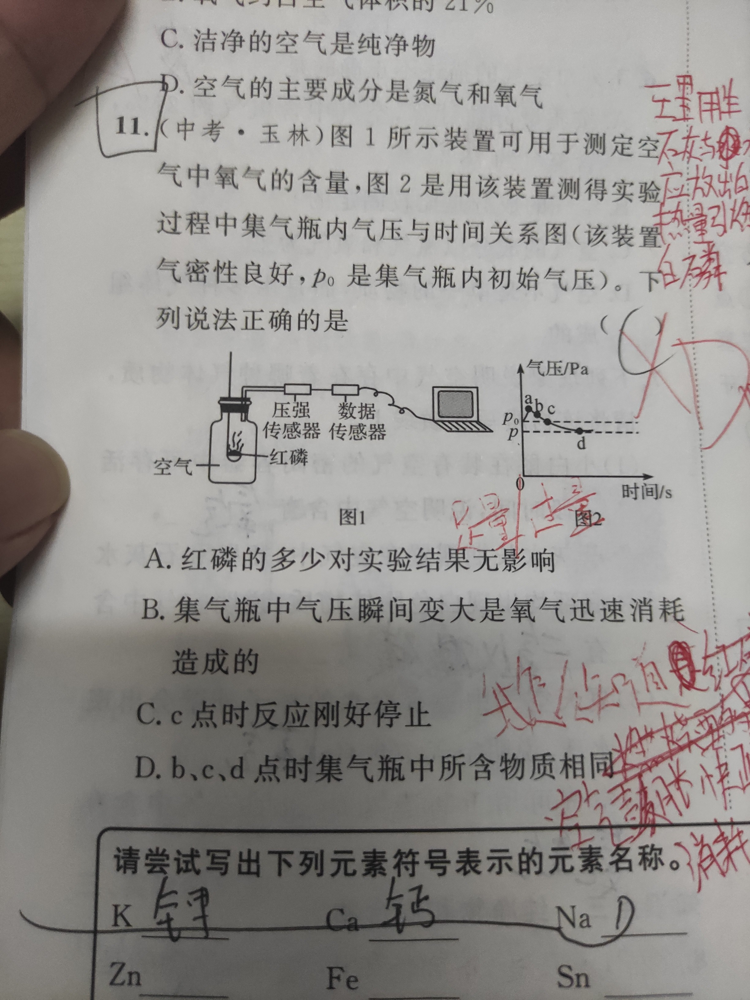<0/></>

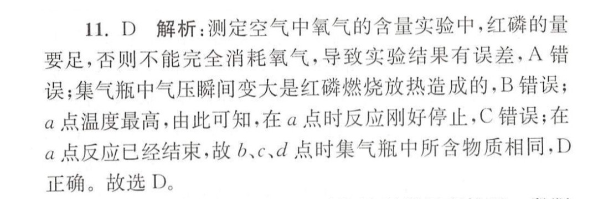<0/><此为上图解析，为什么a点温度最高？图二的纵轴为气压而非温度，如果红磷燃烧消耗大量氧气，气压不就下降了吗？/>

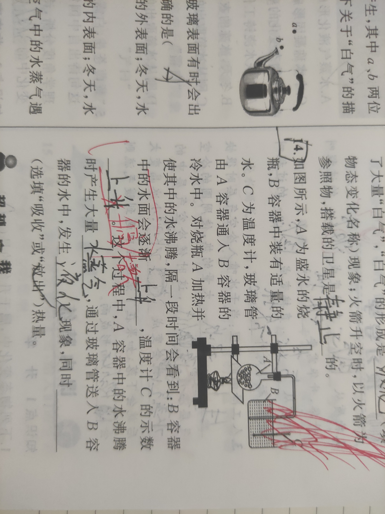<0/><水蒸气携带的热会不会让B容器里的水蒸发？/>

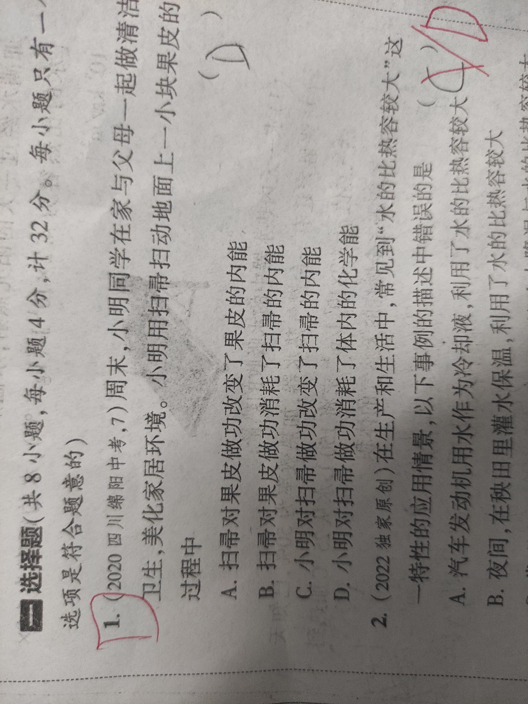<0/><化学能是什么呢/>

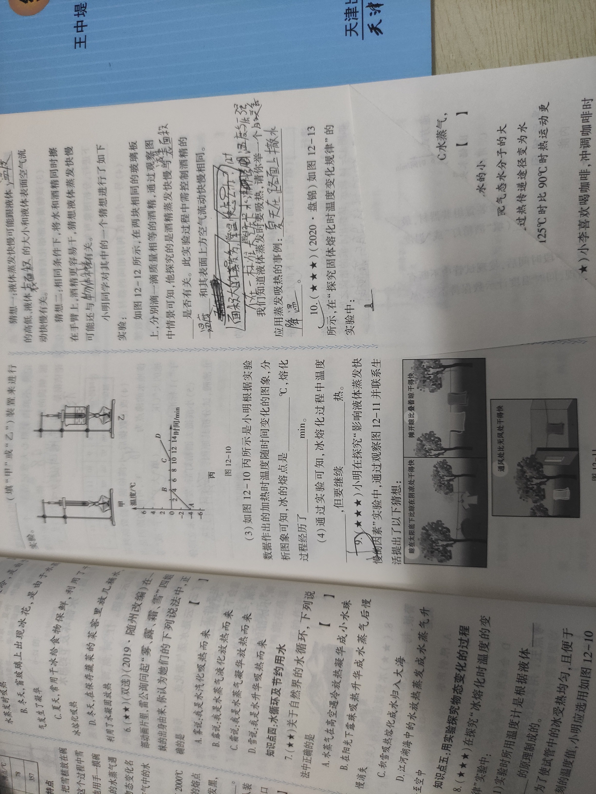<0/></>

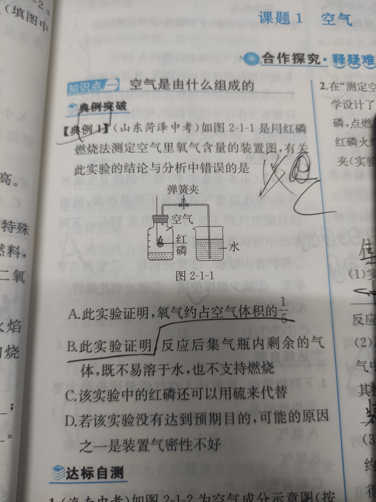<0/><为什么不能用硫代替？二氧化硫不会被水吸收吗？/>

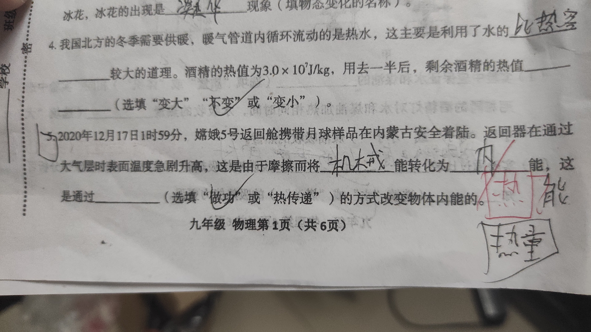<0/><为什么不是热能？/>

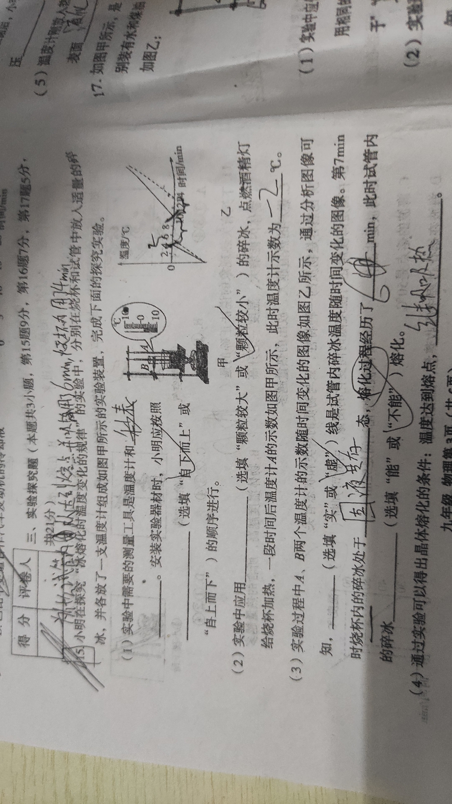<0/><为什么试烧杯的水从达到熔点并继续吸热用了6min，试管内的水用了4min/>

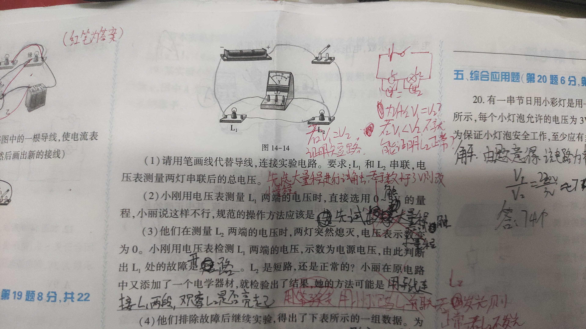<0/></>